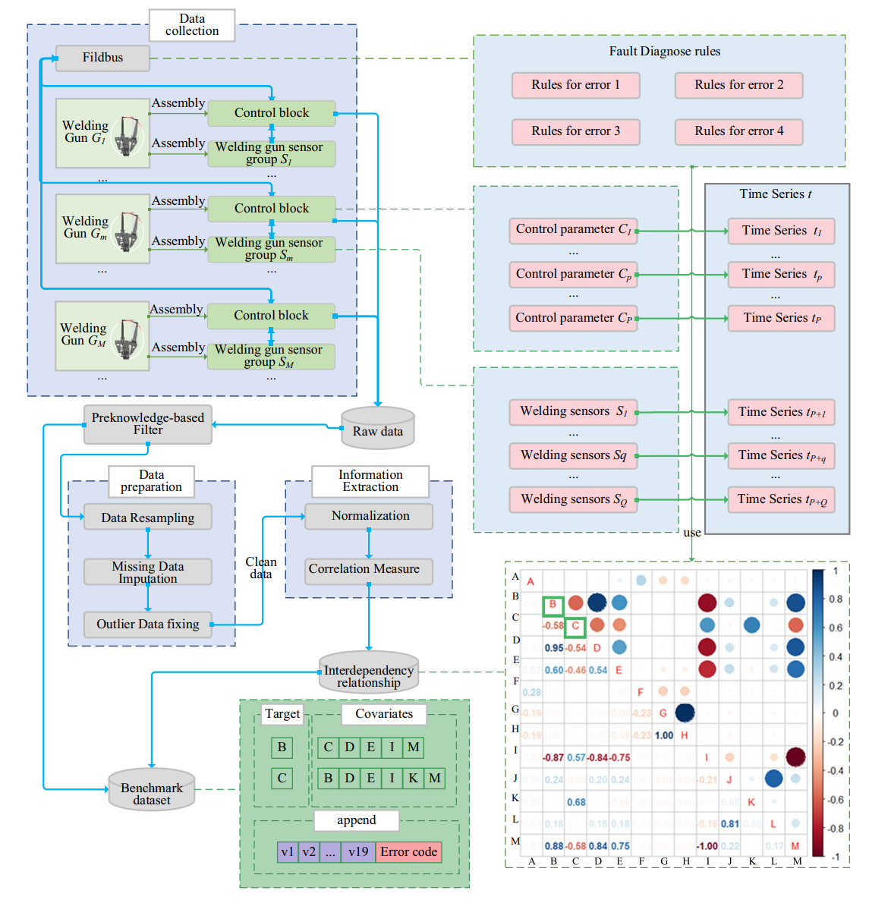

## RSW 용접기 고장 예측 — 이상탐지 파이프라인

저항 점용접기(RSW)의 센서 시계열에서 고장 전조를 실시간으로 탐지하고, 그 신호를 원인 분석(RAG/LLM) 단계로 넘기는 프로젝트다.

- **0~4절**: 데이터와 논문, 접근 방식, 데이터에서 확인한 사실 — *무엇을 왜 하는가*
- **5절**: 구현 워크플로우 — *무엇을 어떤 순서로 돌리면 무엇이 나오는가*
- `test.md`: 현재 모델의 테스트셋 판정과 결과. `MEMORY.md`: 설계 결정과 그 근거. `history.md`: 변경·실험 기록(무엇을 언제 왜 바꿨고 그때 수치가 어땠나). `techspec.md`: 앞으로 개발할 것(ML 파트와 RAG 핸드오프 범위, 우선순위·설계·완료 기준).
- `readme.md`·`test.md`는 **항상 최신 상태와 결과만** 담는다. 바뀐 경위와 이전 수치는 `history.md`에 쌓는다.
- 작업 ID: A 데이터·전처리, B 모델·평가, C 서빙, D RAG 핸드오프 + 번호(예: B-9 앙상블). 대응표는 `history.md` "작업 ID", 남은 작업은 `techspec.md`.

표기: **〔확인〕** = 72파일 EDA로 실측 확인(5.3절), **〔메모〕** = 미결 사항·유의점.

---

### 0. 데이터 파일

https://drive.google.com/drive/folders/1EDQcJj-L1btXrTOmXwPp8Jps24oy989d?usp=drive_link

내려받아 프로젝트 루트에 `train/`(72개 CSV), `test/`(8개 CSV)로 둔다. 두 폴더는 git에 올리지 않는다(`.gitignore`). 원본 총 4,243만 행, 약 5 GB(train 4.4 GB, test 572 MB).

**모델 파일**: `models/*.joblib`(운영 `baseline_ensemble.joblib`, IsolationForest 단독 `baseline_iforest.joblib`)과 `models/scores/`는 git에 올리지 않는다(`.gitignore`). 서버(`main.py`)는 기동 시 번들을 로드하므로, clone 후 둘 중 하나가 필요하다.

- 재학습: `python .py/preprocess.py` → `python .py/preprocess.py --split test` → `python .py/train.py --exclude-non-welding --cv 4`(약 10분) → `python .py/train.py --evaluate`(테스트 지표·`models/scores/`)
- 다운로드: 위 드라이브 링크에서 `.joblib` 파일을 받아 `models/`에 넣는다

---

### 1. 데이터셋과 논문 리뷰

출처: Wang et al., *Scientific Data* 2024 (`docs/RSW Paper.pdf`).

#### 1.1 개요

- 자동차 차체 공장에서 실제로 3년 이상 가동된 **저항 점용접기(RSW) 80대**에서 수집한 다변량 시계열. 용접기의 제어 오류는 예기치 않은 라인 정지를 유발하므로, 과거 관측으로 **기계적 결함을 사전에 예측하고 정비 계획을 세우는 것**이 목적이다.
- 논문 원문: "The resistance spot welding (RSW) welding gun fault prediction benchmark data set has **72 multivariate time series in the training set and 8 in the testing set.** Each time series length 604800(apx.) sampled at 1 Hz with missing values and has 20 dimensions (c1-c19 and the error code). We retain the missing value and the outliers of the welding gun time series for the potential of imputation research in the future."
- "RSW guns are highly nonlinear dynamical machinery systems with interesting physical phenomena over multiple time-dependent components."

**데이터 수집 과정**



#### 1.2 파일 구성

| 항목 | 내용 |
|---|---|
| 컬럼 | `time`, `c1`~`c19`(센서 19종), `error`(상태 코드) — 총 21개 |
| 주기 | 1 Hz(1초), 파일당 약 604,800행 = 7일 |
| train | `E01_0.csv` ~ `E01_17.csv` 식으로 클래스별 18개 × 4클래스 = **72개** |
| test | `test_0.csv` ~ `test_7.csv` = **8개**. 파일명에 클래스가 없다 |
| 총량 | 이론상 80 × 604,800 ≈ 4,840만 행, 결측을 뺀 실제 **4,243만 행** |

- 각 파일은 해당 고장이 발생한 시점에서 **거꾸로 7일치**를 담는다. 즉 파일의 마지막 행이 고장 시점이다.
- **〔확인〕** E01·E03·E04는 72개 전부 정확히 7.00~7.01일이다. **E02만 예외**로 0.01일(E02_2, 10분짜리 데모 파일)부터 7일까지 제각각이다.
- **〔메모〕** 데이터 양 자체는 학습에 충분하다. 이 정도면 ML이나 1D CNN은 수월하게 돌아간다.

#### 1.3 센서 파라미터 19종

영업 비밀 보호를 위해 **정확한 명칭을 마스킹해 `c1`~`c19`로 표기**한다.

| | 이름 | | 이름 |
|---|---|---|---|
| c1 | Electrode cap offset | c11 | Welding point count |
| c2 | Electrode force | c12 | Position count |
| c3 | Electrode position | c13 | Setpoint of counterbalance pressure |
| c4 | Force build-up | c14 | Setpoint of electrode force |
| c5 | Balance pressure | c15 | Setpoint of electrode position |
| c6 | Friction | c16 | Setpoint of sheet thickness |
| c7 | Maximum aperture | c17 | Setpoint of velocity |
| c8 | Maximum electrode force | c18 | Setpoint of force build-up |
| c9 | Start friction | c19 | Offset value in robot **〔확인〕 초당 ~55씩 증가하는 카운터 — 모델 입력에서 제외(5.6절)** |
| c10 | US2 (on/off) | | |

- 마스킹 때문에 도메인 해석에는 한계가 있으나, 데이터에서 역으로 알 수 있는 것이 있다. **`c16`(판 두께 setpoint)이 0 이하이면 용접이 아니라 캡 교체·드레싱 같은 비용접 작업**이다(학습 파일의 카운터 정지 구간은 사실상 전부 `c16 == 0`). 논문·벤치마크 코드는 `c16 > 5`(논문 본문은 6)도 비용접으로 보지만, 그 행들은 시간당 800~980회 용접하는 **두꺼운 판 setpoint**라 이 프로젝트는 **`c16 ≤ 0`만** 비용접으로 본다(5.4절, `--outlier-hi 5`로 논문 규칙 복원 가능, 경위는 `history.md`). 저활동(대기)은 비용접 플래그가 아니라 `welds_10min`·`weld_duty_10min` 피처가 표현한다.
- **〔확인〕** `c7`·`c8`·`c9`는 한 파일 안에서 상수다(72개 중 69개). 건별 고유 속성으로 봐야 한다. `c11`·`c12`는 누적 카운터라 절대값이 건마다 다르다.

#### 1.4 `error` 컬럼은 '파일명 클래스'와 별개다

여기가 이 데이터셋에서 가장 헷갈리는 지점이다.

- **`error` 컬럼**은 1초마다 컨트롤러가 내뱉은 **내부 상태 코드**다. 전체 80파일에 등장하는 값은 `0`과 아래 11종이 전부다.

  `E001, E003, E006, E007, E009, E010, E011, E012, E016, E028, E029`

  대부분은 기계를 멈출 정도가 아닌 잔고장·일시적 통신 불량·정비 알림이다.
- **파일명의 E01~E04**는 그 7일의 끝에서 실제로 라인을 세운 **중대 정지 사유**다. 코드 체계가 아예 다르다(`E01` ≠ `E001`).
- **〔확인〕** `error`는 이벤트가 아니라 **몇 시간씩 지속되는 상태**다(E003 에피소드 중앙값 1.5~2시간, 최장 28시간). E003·E011·E029는 며칠 전부터 계속 떠 있어 단독 전조로는 약하다. 입력에는 빈도가 아니라 `error_share_10min`(최근 10분 중 에러 상태였던 비율)으로 넣는다(5.3~5.4절).
- **〔확인〕** 반대로 **클래스별 '종료 코드'는 거의 결정적**이다. 고장 10분 안에 E01→E012(18/18), E02→E016(17/18), E03→E028(18/18), E04→E029(18/18)가 나타난다. 다만 **파일 마지막 행의 코드는 항상 `0`**이라 "마지막 행"이 아니라 "마지막 수 분"을 봐야 한다. 이 매핑은 두 곳에 쓴다 — 테스트 8파일의 클래스 추론(5.5절), API의 `known_code_class_hint`(5.7절).

#### 1.5 4가지 고장 클래스

| 코드 | 상태 명칭 | 발생 조건 (논문 번역) | 종료 코드 |
|---|---|---|---|
| **E01** | Counterbalance timeout (카운터밸런스 시간 초과) | 지정된 보상 압력에 1800 ms 동안 도달하지 못함 | E012 |
| **E02** | Electrode broke (전극 파손) | 전극 위치가 기준 이동의 영점보다 작음 | E016 |
| **E03** | Unwanted movement (원치 않는 움직임) | 실제 위치 값이 실린더 스트로크의 6.5%를 초과해 이탈 | E028 |
| **E04** | Drift (표류/이탈) | 잠긴 실린더가 정지하지 않고 분당 5 mm 이상 움직임 | E029 |
| E00 | Normal state (정상) | 에러 없이 정상 작동 | — |

**E00(정상) 파일은 없다.** 4가지 고장 케이스에 대해서만 18개씩 존재한다. 정상 구간은 각 파일의 고장 이전 부분에서 얻는다 — 이것이 지도학습 대신 **정상 데이터만으로 학습하는 이상탐지**를 택한 이유 중 하나다(2절).

#### 1.6 결측치·이상치를 그대로 남긴 이유

논문은 센서 통신망 패킷 손실로 인한 **결측치와 비용접 동작으로 생긴 이상치를 의도적으로 제거하지 않았다**. 불완전한 실제 산업 데이터를 다루는 강건한 모델 개발을 장려하기 위해서다.

이 프로젝트는 **규칙을 정해 처리한다**: 짧은 gap은 채우고, 긴 gap은 세그먼트를 끊고, 비용접 구간은 플래그를 달아 남긴다(5.4절). 이유는 4절과 `MEMORY.md` 3절에 있다.

---

### 2. 접근 방식 — 논문의 2-stage 대신 1-step 이상탐지

#### 2.1 논문이 한 것

고장 여부를 바로 분류하지 않고 **2단계**로 간다.

1. **Stage 1**: 타깃 파라미터(E02는 전극 압력 `c2`, 나머지는 밸런스 압력 `c5`)의 미래 수치를 시계열로 예측
2. **Stage 2**: 예측된 수치에 기존 고장 진단 규칙(1.5절의 발생 조건)을 적용해 고장 여부를 판정

10개 모델 비교 결과 예측 정확도는 **TFT(Temporal Fusion Transformers)**와 **Random Forest**가 가장 우수했고, 단순 RNN도 안정적이었다.

그런데 그 예측값으로 실제 고장을 판정해 보면:

| 지표 | 값 |
|---|---|
| 평균 정확도 | 68.62% |
| 정상을 고장으로 오인(위양성) | 56% |

같은 프로토콜(다음 60초 상태 분류)로 이 파이프라인을 재면 정확도 0.999, 정상 재현율 1.000, 고장 재현율 0.986으로 논문을 넘는다 — 단 이것은 현재 종료 코드 → 클래스 매핑(상태가 수 분~수일 지속)의 몫이고, 정상→고장 전이는 예측하지 못한다(`test.md` 2.4절). 1단계(Table 11, 다음 60초 센서 예측)에 최신 시계열 기반 모델을 넣으면 Chronos-2가 naive보다 40%, 논문 TFT보다도 정확하지만(같은 조건 재현, MAE 0.147 vs 0.210), 그 예측 오차로는 고장 전조를 가를 수 없다(`history.md` 28절).

#### 2.2 다르게 가는 이유

- **오류가 누적된다.** 미래 60초 센서값을 먼저 예측하고(Stage 1) 그 위에 규칙을 얹으면(Stage 2), 1단계 예측 오차가 2단계 판정 오차로 증폭된다. 위양성 56%가 그 결과다.
- **결측·이상치를 그대로 둔 것**도 모델 오차에 기여했다.
- **〔메모〕** 2-stage 구조를 제대로 재현·튜닝하는 것은 현실적으로 부담이 컸다. 우리 목표는 논문 재현이 아니라 쓸 만한 경보 신호를 만드는 것이다.

#### 2.3 채택한 구조

> 센서를 예측하고 → 그 위에 규칙을 얹어 에러를 판정 **(2-stage)**
> 　　　⇩
> 센서 흐름에서 **곧바로 이상 여부를 판정 (1-step)**

구체적으로는 **비지도 이상탐지 + 지도 분류의 앙상블**이다. 뼈대는 정상 구간만으로 학습하는 IsolationForest — 정상 구간은 파일마다 6일 이상 확보되고, 새 건에서도 무너지지 않는다. 여기에 "고장 전 1시간 vs 정상"을 가르는 LightGBM을 더해 두 점수를 평균한다(2026-09-29, `history.md` 18절). 고장 케이스가 클래스당 18건뿐이라 지도학습 단독은 학습 건에 맞춰져 새 건(테스트)에서 떨어진다 — 비지도 쪽이 그 안전판이다. 세부 설계는 5.6절, 근거는 `MEMORY.md` 4절.

E01~E04를 정답으로 삼는 분류는 하지 않는다(LightGBM도 "고장 전인가"만 가른다). 정상 대비 이탈 정도를 점수로 내고, 클래스 식별은 1.4절의 종료 코드 매핑(`known_code_class_hint`)으로 보조한다. 모델이 약해도 하류 온톨로지가 클래스를 알 수 있게 하는 안전장치다.

---

### 3. 하류 파이프라인 구상 — 원인 분석과 알림

이상탐지 신호가 나온 다음 단계다. **ML 쪽(1~2번과 RAG로 넘기는 핸드오프)은 구현되어 있고, 3~4번(매뉴얼 검색·LLM 리포트)은 RAG 담당이 핸드오프 명세(5.10절)를 받아 구현한다.**

1. 필터링된 강한 이상 시그널이 탐지되면 Root Cause Agent로 전달 → **구현됨**: `severity: critical`(종료 코드 에피소드 시작, 또는 모델 알람이 10분 이상 지속 — C-5)이 트리거 기준
2. Agent가 이상 감지 시점 앞뒤의 센서 수치·로그 스트림을 모아 컨텍스트 구성 → **구현됨**: critical 이벤트마다 **핸드오프 문서**(센서 증상을 말로 번역, 고장 유형, 상황 ID S01~S10)를 만든다(`.py/rag_mapping.py`, 5.10절)
3. 감지된 에러 코드에 맞는 정비 지침서를 Vector DB에서 RAG로 검색 → **온톨로지·RAG 담당**(입력은 핸드오프의 `situation_ids`)
4. LLM이 이상 패턴과 검색된 매뉴얼을 융합해 원인·영향도·조치 가이드를 자연어로 요약 → **RAG 담당**(응답 형식은 5.10.6절)

이후 계획:

- 작업자에게 Slack으로 심각도·이상 항목·요약 원인을 실시간 전송
- 필요시 Markdown/PDF 1-page 장애 분석 리포트 자동 생성

설계상 유의점:

- **알람 피로도.** 너무 예민하면 무시당한다. 그래서 임계값을 오탐률 1% 설계로 잡고, 모델 단독으로는 **10분 연속 초과일 때만** RAG를 트리거하며(3분 연속은 warning의 "지속 알람"), 30분 이상 쉬었다가 재가동한 직후 30분은 모델 알람을 보류한다(C-5, 5.6~5.7절). 종료 코드 규칙은 그대로 즉시 critical.
- **매뉴얼 RAG 구성.** E01~E04는 발생 조건이 명확하므로(1.5절) 클래스별 조치 매뉴얼을 넣어두면 원인 분석 리포트가 성립한다. **〔메모〕** 다만 매뉴얼이 어떤 형태로 주어지는지, 특정 에러에 대한 명확한 해결책이 있는지는 아직 확인 못 했다.

---

### 4. 데이터에서 확인한 사실

72파일 실측(EDA, 5.3절)으로 확정된 내용이다. 여기서 나온 수치가 전처리 규칙(5.4절)의 근거가 된다.

#### 4.1 결측률의 극단적 편차

- E01·E03·E04는 파일당 결측률 **0.7~2.6%**로 양호하다. gap의 99%가 35초 이하다.
- **E02만 심각하다.** 18개 중 **8개가 64~84%**로, 수집 기간 대부분 센서 통신이 끊겨 있다.

| 파일 | 결측률 | | 파일 | 결측률 |
|---|---|---|---|---|
| E02_0 | 81.4% | | E02_5 | 82.8% |
| E02_2 | 82.7% | | E02_6 | 84.5% |
| E02_3 | 64.4% | | E02_7 | 71.2% |
| E02_4 | 82.1% | | E02_8 | 82.6% |

→ 논문 규칙(결측률 40% 초과 폐기)을 적용해 이 8개를 버렸다. **64/72 파일**이 남는다. 살아남은 E02도 최대 39.8%라 클래스 중 가장 나쁘다.

**〔확인〕** 결측은 컬럼 단위가 아니라 **행 단위 block-out**이다. 특정 센서만 비는 게 아니라 그 초의 데이터 전체가 없다. 그래서 gap 60초까지는 직전 값으로 채우고, 그보다 긴 gap은 행을 지우고 **세그먼트를 분리**한다 — 윈도우가 구멍을 넘어가면 안 되기 때문이다.

#### 4.2 수집 시기의 차이

E01·E03·E04는 2021년 8~10월에 몰려 있는데, **E02는 2019년 12월~2020년 7월 데이터가 다수 섞여 있다.** 시기 차이가 분포 차이를 만들 수 있다(미검증, `MEMORY.md` 7절 미결 사항).

#### 4.3 비용접 구간 (c16 이상치)

`c16`(판 두께 setpoint)이 0 이하면 용접이 아닌 작업(캡 드레싱·교체)이다(1.3절). **〔확인〕** 파일당 **0.1~44.1%, 평균 10.1%**를 차지한다. 지워버리면 고장 직전 구간이 통째로 날아가는 파일이 있어서, 센서값은 직전 용접값으로 이어 붙이고 행은 남기되 `non_welding` 플래그를 단다(5.4절).

#### 4.4 레이블 — 시간 기준

레이블은 종료 코드가 아니라 **시간 기준**이다: `ttf_s`(고장까지 남은 초)를 계산해 **마지막 3600초를 `label=1`**로 둔다. 종료 코드는 고장 10분 전에야 뜨므로 정답으로 쓰면 "고장 10분 전 탐지"밖에 안 된다. 종료 코드는 별도 플래그(`terminal_code`)와 클래스 힌트로만 쓴다.

#### 4.5 잔고장 로그는 비율로 입력

`error`는 지속 상태라서(1.4절) 횟수로 세면 28시간짜리 상태가 1회로 잡힌다. 그래서 `error_share_10min`(최근 10분 중 에러 상태 비율)로 넣는다. 전조로서의 가치는 제한적이다(5.3.4).

#### 4.6 기타

- **E02_2는 결측이 아니라 10분짜리 데모 파일이다.** 원본 데이터가 없어 데모로 대체된 것으로 보이며, 7일치가 아니라 0.01일치다. 결측률 82.7%로 어차피 폐기된다.
- **〔확인〕** 센서 간 상관: `c2`↔`c4` +0.94, `c2`↔`c18` +0.89, `c2`↔`c13` −0.88 (논문 SCM 재현, `eda_out/scm_overall.csv`).

---

### 5. 구현 워크플로우

설계 결정의 **이유**는 `MEMORY.md`에, 각 단계의 **동작**은 스크립트 docstring에 있다. 이 절은 "무엇을 어떤 순서로 돌리면 무엇이 나오는지"만 적는다.

#### 5.0 한눈에 보기

```
                 ┌──────────────────────────────────────────────────────────────────┐
 train/*.csv ──► │ .py/eda.py                                                       │──► eda_out/
  (72파일)        │   탐색 · 전처리 규칙의 근거                                          │
                 └──────────────────────────────────────────────────────────────────┘
 train/*.csv ──► .py/preprocess.py ─────────► preprocessed/*.parquet
                                                + scaler.json, preprocess_config.json, manifest.csv
                                                        │ (설정·스케일러 재사용)
 test/*.csv ───► .py/preprocess.py --split test ───────┴► preprocessed/test/*.parquet + manifest.csv
  (8파일)
 preprocessed/ ─► .py/train.py ─────────────► models/baseline_ensemble.joblib   (모델 + 스케일러 + 전처리 설정 + 건별 정규화 레시피 + 검증/CV/테스트 지표)
                                              models/baseline_ensemble_metrics.json
                  .py/train.py --evaluate ──► models/baseline_ensemble_test_metrics.json, models/scores/test_N_ensemble.csv
                  .py/experiments.py ───────► results/B-2/, B-5/  (절제 실험·성능 점검, 운영과 무관)
                  .py/paper_task.py ────────► results/B-6/  (논문 프로토콜 비교)
                  .py/physics.py ───────────► results/B-7/  (상태별 물리 피처 실험)
                  results/B-8/*.py ────────► results/B-8/  (건별 알람률: 진단·대책·설정값 전환)
                  results/B-9/ensembles.py ─► results/B-9/  (앙상블 구성 탐색)
                  results/C-4/, D-5/*.py ──► results/C-4/, D-5/ (운영 모니터링 재생 검증, 증상 임계값)
                  results/A-2/*.py ────────► results/A-2/  (남은 데이터 분석)
                  docs/make_examples.py ────► docs/*.example.json  (응답·핸드오프·trace 예시)
 models/ ───────► main.py (FastAPI) ────────► AnomalyResult JSON + RAG 핸드오프(5.10절) ──► 온톨로지 / RAG / LLM 리포트 / Slack (다른 담당, 미구현)
                                              + /guns/{id}/trace(/view)  이상 추적 차트(static/trace.html)
 test/*.csv ───► .py/replay.py ──(HTTP)──► main.py /predict   (원본 CSV를 실시간 스트림처럼 재생)
```

| 단계 | 명령 | 입력 → 출력 | 소요 |
|---|---|---|---|
| 0. 스모크 테스트 | `pytest` | 합성 데이터 → 임시 폴더 | 1분 |
| 1. EDA (선택) | `python .py/eda.py` | `train/` → `eda_out/` | 40분 |
| 2. 전처리(학습) | `python .py/preprocess.py` | `train/` → `preprocessed/` | 7분 |
| 3. 전처리(테스트) | `python .py/preprocess.py --split test` | `test/` + 2단계 산출물 → `preprocessed/test/` | 40초 |
| 4. 학습·평가 | `python .py/train.py --exclude-non-welding --cv 4` (앙상블, 기본) | `preprocessed/` → `models/` | 10분 (`--model iforest`면 5분) |
| 4'. 테스트 재평가 | `python .py/train.py --evaluate` | `models/` + `preprocessed/test/` → `models/` | 20초 |
| 5. 서빙 | `uvicorn main:app --reload` | `models/` + 센서 스트림 → JSON | — |
| 5'. 스트림 재생 | `python .py/replay.py test/test_0.csv` | 원본 CSV → `/predict` → critical 이벤트 출력 | 건당 7일 ~5분 (20분 청크, 앙상블) |

한 번에: `python .py/preprocess.py && python .py/preprocess.py --split test && python .py/train.py --exclude-non-welding --cv 4` (약 20분). 순서가 중요하다 — 3단계는 2단계의 `scaler.json`·`preprocess_config.json`을 읽고, 4단계는 3단계 산출물이 있어야 테스트 지표를 낸다.

#### 5.1 환경과 파일 배치

```
U3/
├─ train/  test/           원본 CSV (0절 링크, git 제외)
├─ preprocessed/           2·3단계 산출물 (git 제외)
│   └─ test/
├─ eda_out/                1단계 산출물
├─ models/                 4단계 산출물 (joblib 번들, 지표 JSON, scores/)
├─ results/                실험 지표 JSON: 작업 ID별 폴더 — A-1_B-1/ (비용접·건별 정규화), A-2/ (데이터 분석), B-2/ (절제 실험·윈도우 캐시), B-5/ (성능 점검), B-6/ (논문 프로토콜), B-7/ (물리 피처), B-8/ (건별 알람률), B-9/ (앙상블 탐색), C-4/ (모니터링 검증), D-5/ (증상 임계값) — 각 폴더에 재현 스크립트; */cache/는 git 제외
├─ .py/                    파이프라인: preprocess.py, train.py, replay.py(API 스트림 재생), rag_mapping.py(핸드오프 매핑), mock_rag.py(가짜 RAG)
│                          실험: eda.py, experiments.py(B-2~B-5), paper_task.py(B-6 논문 프로토콜), physics.py(B-7 물리 피처)
│                          원본·점검: Benchmark.py, Benchmark_fixed.py, error_check.py·file_check.py
├─ main.py                 FastAPI 서빙 · static/trace.html  이상 추적 차트
├─ state/                  서빙 상태 (RSW_STATE_DIR): guns/<gun_id>.json 건 판정 상태, outbox/<event_id>.json 핸드오프 (git 제외)
├─ tests/                  test_pipeline.py(합성 데이터 E2E·서빙 회귀), test_rag_mapping.py(매핑 단위)
├─ requirements.txt  pyproject.toml  (ruff/black 120자, Benchmark.py·pic code/ 제외)
├─ test.md                 현재 모델의 테스트셋 판정·결과
├─ history.md              변경·실험 기록(시간순) · techspec.md  앞으로 개발할 것
├─ MEMORY.md               설계 결정 기록 · CLAUDE.md  작업 규약
├─ docs/                   논문, 예시 JSON(anomaly_result·rag_handoff·rag_response·trace — `make_examples.py`로 재생성), 회의 자료
└─ pic code/               논문 그림 재현 스크립트 (파이프라인과 무관)
```

- Python 3.11, CPU 전용. `pip install -r requirements.txt`.
- 모든 스크립트는 `__file__` 기준으로 프로젝트 루트를 잡으므로 어느 디렉터리에서 실행해도 된다. 데이터 폴더(`train/`, `test/`, `preprocessed/`) 안에는 산출물을 쓰지 않는다.
- 무거운 작업(EDA, 벤치마크)은 동시에 여러 개 띄우지 않는다(메모리 부족으로 강제 종료된 적 있음). `--pattern "E04_*" --max-files 3`으로 먼저 축소 실행.

#### 5.2 (참고) 벤치마크 코드 리뷰 — `Benchmark.py` → `Benchmark_fixed.py`

논문의 Stage 1(시계열 예측) 원본은 그대로 실행되지 않는다. 고친 것:

- 모든 플롯이 `predl_NBEATS`(마지막에야 정의됨)를 그림 → `NameError`
- 테스트 시계열 전체를 넣고 그 **끝 이후**를 예측해 실측과 겹치는 구간이 없음 → 마지막 `N_PRED`초를 홀드아웃
- PNG 파일명이 `file_name[-4:]`(=".csv")라 테스트 파일끼리 덮어씀
- `accelerator="gpu"` 하드코딩(이 PC는 CPU torch) → `"auto"`
- TFT는 future covariate가 없으면 `add_relative_index=True` 필요
- `darts.mape`는 실측에 0이 있으면 예외(c2·c4는 50~85%가 0) → NaN 처리, MARRE 추가
- pandas 2.x에서 제거된 `resample('S')`, `fillna(method=)`, `to_numeric(errors='ignore')`
- 선행 결측 bfill, 이상치 마스킹을 원-핫 **이전**에 수행, 죽은 `switch` 로직 제거
- 논문 규칙대로 결측률 40% 초과 파일 폐기

10개 모델 전체 학습은 수십 시간 규모라 축소 스모크 테스트만 시도했고, 메모리 부족으로 중단되어 **학습~평가 경로는 실측 검증되지 않았다**(임포트·API 명·경로만 확인). 우리 파이프라인(1-step 이상탐지, 2절)은 이 코드를 쓰지 않는다.

#### 5.3 1단계 — EDA (`python .py/eda.py`, 72파일 약 40분)

전처리 규칙을 정하기 위한 탐색이다. 72개 학습 파일 전체(1 Hz 격자 4,207만 행, 실제 3,765만 행)를 훑는다.

**수행하는 10가지 분석**

| # | 분석 | 답하려는 질문 | 산출물 |
|---|---|---|---|
| 1 | 파일 요약 | 파일마다 얼마나 길고, 얼마나 비었고, 언제 수집됐나 | `file_summary.csv`, `01_missing_outlier_by_file.png` |
| 2 | gap 분포 | 결측이 짧게 흩어져 있나, 길게 뭉쳐 있나 (논문 Fig. 6) | `gap_stats.csv`, `02_gap_length_distribution.png` |
| 3 | c16 이상치 | 비용접 작업이 얼마나 섞여 있나 (논문 Fig. 7) | `03_c16_distribution.png` |
| 4 | 컬럼 통계 | c1~c19의 클래스별 분포, 0 비율, 파일 내 상수 여부 | `column_stats_by_class.csv`, `column_constancy.csv`, `09_sensor_distributions_by_class.png` |
| 5 | error 컬럼 | 어떤 코드가 언제 뜨나, 고장 직전에 뭉치는 코드가 있나 | `error_episodes.csv`, `error_code_*.csv`, `05_error_code_by_ttf.png` |
| 6 | 타깃 드리프트 | 고장이 가까워질수록 c2·c5가 실제로 변하나 | `06_ttf_profiles.png` |
| 7 | 상관 (SCM) | 센서 간 구조가 논문과 같나 (논문 "Filtering") | `scm_overall.csv`, `scm_E0x.csv`, `07_scm_*.png` |
| 8 | 용접 패턴 | 시간대별 가동 리듬이 있나 (논문 Fig. 8) | `08_welding_pattern_hour_of_day.png` |
| 9 | 타임라인 | 수집 시기가 클래스별로 다른가 | `04_collection_timeline.png` |
| 10 | 파일별 개요 | 파일 하나를 눈으로 보면 어떤 모양인가 (논문 Fig. 5) | `files/<파일>.png` (72장) |

전체 요약은 `eda_out/eda_report.md`에 있다. 아래는 그중 전처리 결정으로 직결된 것들이다.

##### 5.3.1 클래스별 요약

| 클래스 | span(일) | 결측률 | 최대 결측 | 폐기 | c16 이상치 | 용접/시간 | c2=0 비율 | c10 on | 에러 에피소드/파일 | 에러 상태 시간비 |
|---|---|---|---|---|---|---|---|---|---|---|
| E01 | 7.01 | 1.1% | 1.7% | 0 | 11.1% | 171 | 69.9% | 74.0% | 4.9 | 3.5% |
| E02 | 6.04 | **43.0%** | **84.5%** | **8** | 15.1% | 331 | 66.4% | 75.5% | **21.6** | 4.8% |
| E03 | 7.01 | 1.2% | 1.8% | 0 | 9.9% | 263 | 59.0% | 65.1% | 4.1 | 5.2% |
| E04 | 7.01 | 1.0% | 2.6% | 0 | 9.2% | 363 | 70.2% | 83.5% | 3.9 | 3.2% |

**〔확인〕** E02만 모든 축에서 이질적이다. 결측률, 에러 에피소드 수, 수집 시기가 전부 다르다. 이 클래스만 따로 다뤄야 할 가능성이 크다.

**〔확인〕** `c2`(전극 압력)가 0인 시간이 전체의 59~70%다. 용접기는 대부분의 시간 동안 실제로 용접하지 않는다. `weld_duty_10min`(최근 10분 중 `c2 > 0` 비율)을 피처로 넣은 이유다.

##### 5.3.2 결측 구조 — gap은 짧고 잦다

gap(연속된 결측 구간) 길이 분포, 단위는 초:

| 클래스 | gap 개수 | 중앙값 | 90% | 99% | 최대 |
|---|---|---|---|---|---|
| E01 | 27,030 | 1 | 5 | 34 | 3,628 |
| E02 | 695,387 | 3 | 12 | 33 | **239,115** |
| E03 | 29,225 | 1 | 6 | 35 | 3,630 |
| E04 | 28,494 | 1 | 5 | 34 | 4,628 |

**결정 근거가 여기 다 있다.** gap의 99%가 35초 이하이므로 **60초까지는 채워도 안전**하다. 반면 최대 gap은 1시간 남짓(E04는 77분, E02는 2.8일)이라 이런 구간을 채우면 상수 덩어리가 생긴다. 그래서 60초 초과 gap은 행을 지우고 세그먼트를 끊는다(5.4절).

E02의 gap 개수가 69만 개로 압도적인 것은 통신이 끊겼다 붙었다를 반복했다는 뜻이다. 단순히 "데이터가 적다"가 아니라 **신호 자체가 너덜너덜하다.**

##### 5.3.3 비용접 구간 (c16)

`c16`이 0 이하인 행의 비율(`preprocessed/manifest.csv`):

| 클래스 | 평균 | 최소 | 최대 |
|---|---|---|---|
| E01 | 10.6% | 1.4% | 22.5% |
| E02 | 13.4% | 1.6% | **44.1%** |
| E03 | 9.3% | 0.1% | 27.3% |
| E04 | 8.6% | 0.8% | 20.8% |

파일당 최대 44.1%다. 이 행들을 버리면 파일의 절반이 날아간다. 그래서 **행은 남기고 센서값만 직전 용접값으로 잇고 `non_welding` 플래그를 단다**(5.4절).

##### 5.3.4 `error` 컬럼 — 이 프로젝트에서 가장 중요한 발견

**(a) 코드는 이벤트가 아니라 지속 상태다.** 에피소드(코드가 끊기지 않고 이어진 한 구간) 단위로 보면:

| 코드 | 에피소드 중앙 길이 | 최장 | 성격 |
|---|---|---|---|
| E003 | 1.6~1.8시간 | 16.5시간 | 장시간 지속 상태 |
| E011 | 1.2~2.6시간 | **27.9시간** | 장시간 지속 상태 |
| E029 | 1~11분 | 24.4시간 | 혼재 |
| E012 / E016 / E028 | 28~95초 | 10분 | 짧은 종료 신호 |

중앙 길이는 E02를 뺀 값이다. E02는 짧게 끊겼다 붙는 에피소드가 많아(E003 중앙 4초, 에피소드 203개) 중앙값이 무의미하다. 통신 품질 문제로 보인다(5.3.2).

E011 하나가 **27.9시간** 지속되기도 한다. **"최근 10분간 에러 발생 횟수"로 세면 이게 1회로 잡힌다.** 그래서 횟수가 아니라 **비율**(`error_share_10min`)로 만들었다(4.5절).

**(b) 종료 코드는 거의 결정적이다.** 고장 전 마지막 10분에 등장한 코드를 파일 수로 세면:

| 클래스 | E012 | E016 | E028 | E029 | E003 | 기타 |
|---|---|---|---|---|---|---|
| E01 | **18** | 0 | 0 | 1 | 3 | 1 |
| E02 | 1 | **17** | 1 | 2 | 2 | 4 |
| E03 | 0 | 0 | **18** | 0 | 0 | 0 |
| E04 | 0 | 0 | 0 | **18** | 0 | 0 |

E03과 E04는 18/18 완벽하다. 이 매핑으로 테스트 8파일의 클래스를 역추론한다(5.5절).

**〔함정〕** "파일의 마지막 코드"로 세면 E01이 15/18로 떨어진다. E01_4·E01_6·E01_9는 E012가 뜬 뒤 다시 `0`이나 E003으로 바뀐 채 끝난다. **마지막 행이 아니라 마지막 10분을 봐야 하는 이유다.**

**(c) 고장까지 남은 시간별 코드 점유율.** 전체 present 시간 중 해당 코드였던 비율:

| 코드 | 마지막 10분 | 10분~1h | 1~6h | 6~24h | 24h 초과 |
|---|---|---|---|---|---|
| E029 | **19.7%** | 1.4% | 0.13% | 0.08% | 0.9% |
| E028 | **6.7%** | 0.008% | ~0 | 0 | ~0 |
| E012 | **6.3%** | 0.009% | 0.01% | 0.002% | 0.004% |
| E016 | **3.1%** | 0.006% | 0 | 0 | 0 |
| E003 | 3.1% | **14.0%** | 4.9% | 0.8% | 2.3% |
| E011 | 0.5% | 0 | 0.7% | **2.0%** | 0.9% |

**이 표가 2절 가설의 판정이다.** E012·E016·E028·E029는 마지막 10분에만 몰려 있어 **전조가 아니라 사후 확인**이다. 반대로 E003·E011은 24시간 전에도 계속 떠 있어 **전조로 쓰기엔 변별력이 없다.** 즉 "잔고장 빈도 = 전조" 가설은 **절반만 맞다**(1.4절).

##### 5.3.5 파일 내 상수 컬럼

| 컬럼 | 이름 | 상수인 파일 수 | 중앙 고유값 수 |
|---|---|---|---|
| c7 | Maximum aperture | **69/72** | 1 |
| c8 | Maximum electrode force | **69/72** | 1 |
| c9 | Start friction | **67/72** | 1 |
| c17 | Setpoint velocity | 17/72 | 2 |

`c7`·`c8`·`c9`는 시계열이 아니라 **건의 고유 속성(정적 공변량)**이다. z-score 후에는 사실상 "이 건이 누구인가"를 알려주는 ID가 된다. 현재 모델은 건별 centering(5.6절)으로 이 셋을 0으로 만들어 건 ID 역할을 없앤다(`--drop-static`으로 전처리에서 뺄 수도 있다).

##### 5.3.6 센서 상관 (SCM)

논문의 타깃 두 개에 대해 |r|이 큰 순서:

- `c2`(전극 압력): `c4` +0.94, `c18` +0.89, `c13` −0.88, `c3` −0.66, `c5` +0.65
- `c5`(밸런스 압력): `c18` +0.71, `c13` −0.70, `c2` +0.65, `c4` +0.57, `c3` −0.49

논문 SCM과 같은 구조가 재현된다. 압력 계열(`c2`·`c4`·`c5`·`c18`)이 한 덩어리로 움직이고 `c13`이 반대로 간다. **〔메모〕** 상관이 0.9를 넘는 쌍이 있으므로 차원 축소나 피처 선택의 여지가 있다. 현재 모델은 46개(c19 제외)를 그대로 넣는다.

##### 5.3.7 발견 → 결정 요약

| 발견 | 수치 | 결정 |
|---|---|---|
| 결측은 행 단위 block-out | gap 99%가 ≤35초, 최장 1시간 남짓. **E02 8개 파일이 64~84%** | 40% 초과 폐기, ≤60초 ffill, 긴 gap은 세그먼트 분리 |
| c16 ≤ 0 = 캡 드레싱 (`>5`는 두꺼운 판 용접, 1.3절) | 파일당 0.1~44.1%, 평균 10.1% | 센서값 carry-forward + `non_welding` 플래그, 학습 제외 + 알람 게이트(5.6절) |
| **error는 이벤트가 아니라 상태** | E003·E011 에피소드가 수 시간~28시간 | 횟수 대신 `error_share_10min` 비율 |
| 종료 코드가 거의 결정적 | 마지막 10분 기준 18/18, 17/18, 18/18, 18/18 | `terminal_code`, 테스트 클래스 추론, `known_code_class_hint` |
| 전조 코드는 사실상 없음 | E012류는 마지막 10분, E003류는 24h 전에도 상시 | 1-step 이상탐지로 방향 확정(2절) |
| c7·c8·c9는 파일 내 상수 | 69/69/67 of 72 | 정적 공변량, `--drop-static` 옵션 |
| c11·c12는 누적 카운터 | 절대값이 건마다 다름 | 증분 + 10분 롤링 합으로 대체 |
| c2가 0인 시간이 59~70% | 대부분 비가동 | `weld_duty_10min` 피처 |
| 수집 시기 | E02 일부는 2019-12~2020-07, 나머지는 2021-08~10 | `04_collection_timeline.png` |

#### 5.4 2단계 — 전처리, 학습 파일 (`python .py/preprocess.py`)

처리 순서(파일마다): 1 Hz 격자 정렬 → 결측률 >40% 파일 폐기 → error 코드 gap 너머로 carry → gap ≤60초 ffill, 초과 gap은 행 삭제·`segment_id` 분리(`fill_gaps()`, 서빙과 공유) → c16 규칙(`c16 <= 0`; `--outlier-hi`로 상한 추가 가능)으로 비용접 행 센서값 blank + carry, `non_welding` 플래그 → c11/c12 → 증분·10분 롤링 → 시각 피처, `ttf_s`, `label` → 정상행(`label==0 & error_active==0`)으로 z-score fit(글로벌) → 저장.

출력 `preprocessed/`:

| 파일 | 내용 |
|---|---|
| `<파일>.parquet` | 1 Hz, float32. `file, class, gun, segment_id` · 센서 `c1~c9, c13~c19`(z-score), `c10`(0/1) · 파생 `welds_delta, pos_delta, welds_10min, weld_duty_10min, error_share_10min, hour_sin, hour_cos, dow` · 상태 `error_code, error_active, terminal_code, non_welding` · 레이블 `ttf_s`, `label`(마지막 3600초=1) |
| `manifest.csv` | 파일별 행·세그먼트·결측률·비용접 비율·폐기 사유·`class_source` |
| `scaler.json` | 스케일 컬럼별 mean/std (3단계·서빙이 읽음) |
| `preprocess_config.json` | 사용한 옵션 (3단계·4단계 번들이 읽음) |

주요 옵션: `--max-missing-rate 0.4`, `--gap-fill-limit 60`, `--pre-failure-window 3600`, `--resample 10s`, `--scale global|per-file|none`, `--drop-static`. `per-file`·`--resample`은 실험용이다 — 서빙이 재현할 수 없어 그 번들은 API가 기동을 거부한다.

결과: 64/72 파일, 37.5M행, 1,047 세그먼트. 폐기 8개는 모두 E02(결측 64~84%).

##### 5.4.1 파생 피처와 플래그 상세

parquet 한 파일은 **35개 컬럼**이다. 그중 **24개만 모델 입력**이고 나머지 11개는 식별자·레이블·평가용이다.

**(a) 원본 카운터를 대체한 파생 피처 (5개)**

| 컬럼 | 계산식 | z-score | 모델 입력 | 왜 이렇게 |
|---|---|---|---|---|
| `welds_delta` | `c11`을 **세그먼트 안에서** `diff()` → `clip(lower=0)` | ✅ | ✅ | `c11`은 누적 카운터라 절대값이 건마다 다르다. 증분으로 바꿔야 건끼리 비교된다. 세그먼트 경계에서 diff하면 gap만큼의 가짜 점프가 생기므로 세그먼트별로 끊어 계산하고, 카운터 리셋 대비 음수는 0으로 자른다 |
| `pos_delta` | `c12`에 동일 | ✅ | ✅ | 위와 같음 |
| `welds_10min` | `welds_delta`의 10분 롤링 **합** | ✅ | ✅ | 순간 증분은 0/1이라 정보가 적다. 10분 누적이 "지금 이 건이 얼마나 일하고 있나"를 나타낸다 |
| `weld_duty_10min` | `(c2 > 0)`의 10분 롤링 **평균** | ❌ | ✅ | 가동률(0~1). c2가 0인 시간이 59~70%이므로(5.3.1) 가동/비가동 리듬 자체가 신호다. **이미 0~1이라 스케일링 제외** |
| `error_share_10min` | `error_active`의 10분 롤링 **평균** | ❌ | ✅ | 최근 10분 중 에러 상태였던 비율. 횟수가 아니라 비율인 이유는 5.3.4(a). **이미 0~1이라 스케일링 제외** |

**〔함정〕** `weld_duty_10min`·`error_share_10min`을 정상행 기준 z-score에 넣었더니 30 같은 값이 나왔다. 정상행에서는 이 값이 거의 0이라 표준편차가 극단적으로 작아지기 때문이다. 그래서 이 둘만 스케일링에서 뺐다.

**〔주의〕** `c11`·`c12`는 비용접 구간에서도 **blank 처리하지 않는다.** 캡 드레싱 중에도 카운터는 계속 돌기 때문이다. 나머지 센서(`c1`~`c9`, `c13`~`c19`, `c10`)만 blank 후 carry-forward한다.

**(b) 상태 플래그 (4개) — 전부 모델 입력이 아니다**

| 컬럼 | 계산식 | 용도 |
|---|---|---|
| `error_code` | 원본 `error`를 **gap 너머로 carry** | 맥락 정보. API의 `latest_error_code`, 클래스 추론 |
| `error_active` | `error_code != "0"` | **정상 구간 정의에 쓰인다**: 학습은 `label==0 & error_active==0` 행만 |
| `terminal_code` | `error_code`가 이 클래스의 종료 코드인가 (E01→E012 …) | 분석·평가용. 모델에 넣으면 정답 누설 |
| `non_welding` | `c16 <= 0` (`--outlier-hi 5`를 주면 `c16 > 5`도 포함 — 논문·벤치마크 규칙, 기본은 끔) | 비용접 표시. 기본 학습은 `--exclude-non-welding`으로 제외하고, 비율이 0.5를 넘는 윈도우는 알람 보류(5.6절) |

`error_code`를 **gap 너머로 carry**하는 것이 중요하다. 코드는 지속 상태인데(5.3.4) 통신이 끊긴 구간에서 `0`으로 리셋해 버리면 하나의 에피소드가 여러 개로 쪼개진다.

**〔주의〕** `terminal_code`와 `error_active`를 모델 입력에 넣으면 안 된다. 종료 코드는 고장 10분 전에만 뜨므로 모델이 이것만 외우면 AUROC는 올라가도 실제 전조 탐지는 0이 된다. `train.py`의 `META_COLS`가 이 네 컬럼을 입력에서 제외한다.

**(c) 시각 피처 (3개)**

| 컬럼 | 계산식 | 모델 입력 |
|---|---|---|
| `hour_sin` | `sin(2π × (시 + 분/60) / 24)` | ✅ |
| `hour_cos` | `cos(2π × (시 + 분/60) / 24)` | ✅ |
| `dow` | 요일 0~6 | ❌ (정수라 z-score와 섞이면 곤란) |

시각을 0~23 정수로 넣으면 23시와 0시가 가장 먼 값이 된다. sin/cos 쌍으로 넣으면 원형으로 이어져 자정을 넘는 연속성이 유지된다. 공장은 교대조 리듬이 있으므로(논문 Fig. 8) 시간대가 정상 패턴의 일부다.

**〔주의〕** 시각은 **naive UTC**로 통일한다. KST로 바꾸면 `hour_sin`/`hour_cos`가 학습과 서빙에서 어긋난다.

**(d) 레이블 (2개)**

| 컬럼 | 계산식 | 용도 |
|---|---|---|
| `ttf_s` | `파일 마지막 시각 − 현재 시각`(초) | 평가축. "고장 N시간 전" 분석 전부가 이걸 쓴다 |
| `label` | `ttf_s <= 3600` | 고장 전 1시간 = 1. 평가의 양성 클래스 |

둘 다 모델 입력이 아니다. 비지도 학습이므로 `label`은 **정상 구간을 고르는 데**(학습)와 **점수를 채점하는 데**(평가)만 쓴다. `--pre-failure-window`로 1시간을 바꿀 수 있다.

**(e) 센서 원본 (17개)**

`c1`~`c9`, `c13`~`c19`는 z-score 후 그대로 입력(16개). `c10`은 on/off를 1/0으로 바꿔 입력(1개). `c11`·`c12`는 (a)의 파생으로 대체되어 **parquet에 남지 않는다.**

**(f) 식별자 (4개)**

`file`, `class`, `gun`, `segment_id`. 전부 메타데이터다. `segment_id`는 윈도우가 gap을 넘지 않게 하는 데 쓰인다(5.6.1).

#### 5.5 3단계 — 전처리, 테스트 파일 (`python .py/preprocess.py --split test`)

같은 코드 경로를 타되 세 가지가 다르다.

- 명시하지 않은 옵션은 2단계의 `preprocess_config.json`에서 가져온다. z-score는 `scaler.json`을 적용만 하고 **재적합하지 않는다**.
- 파일명(`test_N`)에 클래스가 없으므로 마지막 10분의 종료 코드로 추론해 `class`에 넣고, 근거를 `manifest.csv`의 `class_source`에 남긴다(여러 코드가 있으면 고장에 가장 가까운 것: test_3은 E016→E029라 E04).
- 출력은 `preprocessed/test/`. 2단계 산출물을 덮어쓰지 않고 `scaler.json`도 쓰지 않는다.

결과: 8/8 유지, 4.83M행. 추론 클래스 E01×2(test_0,1), E02×1(test_2), E03×2(test_4,5), E04×3(test_3,6,7). 비용접 비율 0.0~11.8%(test_2 2.5%, test_3 2.1%). test_2·test_3은 행의 85~92%가 `c16 = 8.7`(두꺼운 판, 대부분 대기 상태)이다.

#### 5.6 4단계 — 학습·평가 (`python .py/train.py`)

- 세그먼트 안에서 60초 윈도우 집계(연속 피처 23개 × mean/std = **46 피처**, 학습 ~60만 윈도우). 상세는 5.6.1. `c19`는 파일 안에서 초당 ~55씩 단조 증가하는 카운터라(경과 시간과 상관 1.000) 7일짜리 파일에서는 "고장까지 남은 시간"과 같은 레이블 누설이므로 기본으로 입력에서 뺀다(`--drop-features`, 번들 `dropped_features`)
- **파일(=건) 단위** 클래스별 층화 분할, 25% 검증(14개 건)
- **모델 = IsolationForest + LightGBM 앙상블**(`--model ensemble`, 2026-09-29 운영 기본, `history.md` 18절). IsolationForest(300 trees; 시각·c7~c9 제외)는 정상 윈도우(`label==0 & error_active==0`, **비용접 비율 > 0 제외** = `--exclude-non-welding`) 418,328개로, LightGBM은 고장 전 1h(비용접 제외) vs 같은 정상 윈도우로 학습한다. 두 점수를 각각 학습 정상 창 CDF로 바꿔 평균(`--lgbm-weight` 0.5); LightGBM의 CDF와 임계값은 건 단위 out-of-fold 점수로 잡는다(제 학습 창을 과소평가하는 부스팅의 낙관 편향 제거). 다른 구성은 `--ensemble-components iforest,lgbm,lgbm6h,et`(B-9 비교). IsolationForest 단독은 `--model iforest`(`models/baseline_iforest.joblib`, 이전 운영 모델)
- **건별 정규화**: 파일(스트림)의 첫 6시간 중 정상·용접 행의 평균을 이후 행의 z-score 입력 19개에서 뺀다(`--gun-norm center`; 건 상수 c7~c9는 0이 됨). 워밍업 6시간은 글로벌 스케일로 점수화하고 `warmup` 플래그를 단다. 정상·용접 행이 600개 미만이면 그 파일은 글로벌 유지. `--warmup-rows N`을 주면 정상·용접 행 N개가 모이는 즉시 끝난다(최대 `--warmup-hours`) — 실험에서 이득이 없어 기본은 6시간 고정(`history.md` 15절). `--gun-norm scale`(std까지 나눔)은 워밍업이 대기 상태인 건에서 폭주하므로 쓰지 않는다(`test.md` 4절)
- **워밍업 알람 보류**(2026-09-29): 워밍업 창은 점수는 내지만 모델 알람은 내지 않는다(번들 `warmup_alarms: false`, 응답 `alarm_held` + `hold_reason` "gun warm-up…"; 종료 코드 규칙은 그대로 동작). 워밍업 창은 글로벌 스케일이라 건 고유 상수(c7~c9)가 최대 14σ로 보여, E02_14·E02_13·E02_10은 워밍업 창의 84~96%가 알람이었다. 점수가 그대로라 AUROC는 불변, 4-fold 정상 알람률 1.5→0.95%, 건별 최대 19.3→7.8%(`history.md` 17절). `--warmup-alarms`로 이전 동작.
- 임계값 = 학습 정상 점수(앙상블은 CDF 평균, 0~1)의 99% 분위수(글로벌 0.9458, 오탐률 1% 설계). **건별 임계값** = max(글로벌, 워밍업 윈도우 중 정상·용접 창(에러 상태 아님, 비용접 비율 ≤ 게이트)을 건별 통계로 재정규화한 점수의 99% 분위수, 10창 미만이면 없음) — 기본 켜짐, `--no-gun-threshold`로 해제. `sustain=3` 연속 초과 = 지속 알람
- **비용접 게이트**: 윈도우의 비용접 비율이 `--alarm-max-non-welding`(기본 0.5, `none`으로 해제)을 넘으면 임계값을 넘어도 알람으로 세지 않는다(보류). 값은 번들에 들어가 서빙도 같은 규칙을 쓴다. 지표에 보류된 알람 수(`held_windows`)·게이트 대상 윈도우 비율(`held_share_of_windows`)·용접 윈도우만의 AUROC(`auroc_welding_windows`)가 함께 나온다
- 평가 = AUROC/AUPRC(고장 전 1h vs 정상), 정상 알람률, 클래스별, 파일별 "고장으로 이어지는 마지막 알람 구간 시작 시각"(고장 24h 이내에 시작한 구간만 — 며칠째 켜진 알람은 예측이 아니다)과 "24h 이전 오탐 에피소드/일". AUROC 계열의 음성은 정상 창(에러 상태 창 제외). AUROC는 세 가지로 본다: 풀링(`auroc`), **건별 평균**(`auroc_gun_mean`, 파일별 `per_file[*].auroc` — 건 간 점수 오프셋이 빠진 건 안 분리력), **규칙 이전**(`auroc_pre_rule` — 고장 10분 이전 전조 윈도우만 양성. 마지막 10분은 종료 코드 규칙이 잡으므로 모델이 더하는 몫은 이것). 여기에 **운영점**(`operating_point`: 선행 ≥30분 **그리고** 오탐 ≤1회/일/건을 만족한 건 수)과 **종료 코드 규칙 기준선**(`rule_terminal_code`: 서빙과 같은 발화 규칙의 적중·선행·critical 오트리거/일, 24h 반복 강등 수 `n_repeats`)이 항상 같이 나온다
- `--cv 4`: 건 단위 층화 4-fold를 먼저 돌려 `metrics["cv"]`에 폴드별·평균±편차를 남긴다(한 분할의 AUROC는 ±0.04 흔들린다 — 구성 비교는 이것으로). `--label-window 1800`: 레이블 창을 바꿔 평가(전처리 재실행 불필요). 창을 좁히면 AUROC가 오르지만 이득은 전부 마지막 10분에서 나오므로 기본 1시간을 유지한다(`history.md` 11.4)
- 검증 후 `preprocessed/test/`가 있으면 **같은 임계값으로 테스트도 자동 평가**해 `metrics["test"]`에 넣는다(`--no-test`로 생략)

현재 모델(앙상블, c19 제거·46피처; IsolationForest 단독 등 이전 수치는 `history.md` 17·18절). AUROC 계열은 고장 전 1h vs 정상 창(에러 상태 창 제외):

검증(14개 건):

| | AUROC | recall@1h | 정상 알람률 | 건별 정상 알람률 |
|---|---|---|---|---|
| 전체 | 0.767 (건별 0.774, 규칙 이전 0.729) | 0.161 | 0.010 | 0.1~3.2% (sd 0.8%) |
| 4-fold (64건) | 0.688 ± 0.057 (건별 0.705 ± 0.042, 규칙 이전 0.644 ± 0.060) | 0.087 ± 0.029 | 0.008 ± 0.003 | 최대 5.5% (E02_13) |
| E01 | 0.839 | 0.180 | 0.009 | |
| E02 | 0.819 | 0.194 | 0.007 | |
| E03 | 0.765 | 0.241 | 0.010 | |
| E04 | 0.668 | 0.050 | 0.013 | |

테스트(8개 건, 클래스는 추론값):

| | AUROC | recall@1h | 정상 알람률 | 건별 정상 알람률 |
|---|---|---|---|---|
| 전체 | 0.713 (건별 0.703, 0.41~0.91; 규칙 이전 0.671) | 0.075 | 0.006 | **0.1~1.4%** (sd 0.4%) |
| E01 (2) | 0.537 | 0.025 | 0.011 | |
| E02 (1) | 0.913 | 0.133 | 0.001 | |
| E03 (2) | 0.860 | 0.117 | 0.003 | |
| E04 (3) | 0.622 | 0.061 | 0.005 | |

운영점(선행 ≥30분 & 오탐 ≤1회/일): 검증 0/14, 테스트 0/8. 고장으로 이어지는 지속 알람 검증 9/14·테스트 2/8이지만 선행 중앙값 9.1분·5.8분 — 규칙이 잡는 마지막 10분 안이다. 정상 구간 지속 오탐은 테스트 최대 0.83회/일(8/8건 ≤1회), 검증 12/14건 ≤1회. 종료 코드 규칙 기준선: 8/8건, 선행 중앙값 9.2분, critical 오트리거 0.18회/일/건(반복 강등 4회, 강등하지 않으면 0.25).

→ 앙상블로 고장 10분 전 분리력(규칙 이전 AUROC)이 IsolationForest 단독 대비 4-fold 0.594→0.644, 테스트 0.619→0.671, 고장 전 1h 알람률이 테스트 3.5→7.5%로 올랐다. 그래도 **30분 이상 선행하는 지속 알람은 0건**이다(`test.md` 1절). 종료 상태(E029 등)는 모델이 아니라 규칙(`rule_triggered`)이 잡는다. 파일별 결과와 원인은 **`test.md`**, 절제 실험 경과는 **`history.md`**에 있다.

산출물 `models/`:

| 파일 | 내용 |
|---|---|
| `baseline_ensemble.joblib` (운영) · `baseline_iforest.joblib` | `{model, feature_cols, model_cols, window, threshold, sustain, alarm_max_non_welding, gun_norm, dropped_features, scaler, preprocess_config, feature_reference, feature_scale, metrics, train_files, val_files, args, created}` — 서빙에 필요한 것이 전부 들어 있다. `gun_norm` = `{mode, warmup_s, min_rows, std_floor, threshold_q, columns}`. `metrics`에는 검증·테스트 외에 `cv`(건 단위 k-fold)가 있고, 각 평가에는 `operating_point`(선행 ≥30분 & 오탐 ≤1/일 충족 건 수)와 `rule_terminal_code`(종료 코드 규칙 기준선)가 들어 있다 |
| `baseline_<model>_metrics.json` | 위에서 `model`만 뺀 것 |
| `baseline_<model>_test_metrics.json` | `--evaluate` 결과 |
| `scores/test_N_iforest.csv` | `--evaluate`가 쓰는 파일별 윈도우 점수(`score, alarm, threshold, ttf_s, label, error_active, terminal_any, terminal_idx, non_welding, warmup`) — `threshold`는 그 윈도우를 판정한 값(워밍업은 글로벌, 이후는 건별) |

다른 진입점: `--evaluate`(학습 없이 저장 번들로 테스트만), `--score <parquet>`(파일 하나 스코어링 → `models/scores/`), `--model iforest`(IsolationForest 단독, 이전 운영 모델)·`--model pca`, `--ensemble-components`·`--lgbm-weight`(앙상블 구성, `history.md` 18절), `--window 120`, `--alarm-max-non-welding none`(게이트 해제), `--gun-norm none`·`--no-gun-threshold`·`--warmup-hours 6`(건별 정규화 관련), `--drop-features`(기본 `c19`), `--cv 4`(건 단위 k-fold), `--label-window 1800`(레이블 창 변경), `--max-files 8`(빠른 확인). 현재 `models/`의 번들은 `python .py/train.py --exclude-non-welding --cv 4`로 만든 것이다. 절제 실험 지표는 `results/A-1_B-1/`(A-1·B-1), `results/B-2/`(B-2~B-4), `results/B-5/`(B-5: 레이블 창·정비 이력 4-fold; B-2~B-5 모두 `.py/experiments.py`가 만든다), `results/B-6/`(B-6: 논문 프로토콜 비교·에러 코드 이력, `.py/paper_task.py`), `results/B-7/`(B-7: 물리 피처, `.py/physics.py`)에 있다. 코드에서는 `from train import load_bundle, score_frame`.

##### 5.6.1 윈도우 처리 상세

**왜 윈도우로 묶나.** 3,750만 개의 1초 행을 그대로 모델에 넣을 수 없다. 메모리와 시간 문제도 있지만, 더 중요한 이유는 **1초 스냅샷에는 시간적 맥락이 없다**는 것이다. 60초를 묶어 평균과 표준편차를 내면 "지금 값이 얼마인가"에 더해 **"지금 얼마나 흔들리고 있나"**가 들어온다. 결과적으로 3,750만 행이 약 60만 윈도우가 된다.

**묶는 기준.** `(segment_id, 60초 시계 경계)` 두 개로 그룹을 만든다.

```python
df.groupby([df["segment_id"], pd.Grouper(freq="60s")])
```

- **`segment_id`로 먼저 나누는 이유**: 윈도우가 긴 gap을 넘어가면 안 된다. 5.4절에서 60초 초과 gap마다 세그먼트를 끊어 두었으므로, 여기서 세그먼트별로 그룹핑하면 한 윈도우가 구멍 양쪽을 섞는 일이 없다.
- **시계 경계 정렬**: `00:00:00`~`00:00:59`, `00:01:00`~`00:01:59` 식으로 분 경계에 맞춰 자른다. 슬라이딩 윈도우가 아니라 **겹치지 않는 고정 구간**이다. 겹치게 하면 윈도우 수가 60배로 늘고 인접 윈도우가 거의 동일해져 검증이 낙관적으로 왜곡된다.

**집계 규칙.** 컬럼 종류마다 다르다.

| 대상 | 집계 | 결과 컬럼 | 모델 입력 |
|---|---|---|---|
| 연속 피처 24개 (모델 입력은 c19를 뺀 23개) | `mean` + `std` | `c5_mean`, `c5_std` … | ✅ **46개** (c19 제외) |
| `error_active`, `terminal_code`, `terminal_any`, `terminal_idx`, `label` | `max` | 같은 이름 | ❌ 평가·정상구간 판정용 (`terminal_idx` 1~4 = 어느 종료 코드인지, 규칙 반복 판정용) |
| `non_welding` | `mean` | `non_welding` | ❌ 비용접 비율 |
| `ttf_s` | `min` | `ttf_s` | ❌ 평가축 |
| 샘플 수 | `size` | `n` | ❌ 품질 필터 |

- **플래그는 `max`**: 60초 중 한 번이라도 에러 상태였으면 그 윈도우는 1이다. `label`도 마찬가지라, 고장 1시간 경계에 걸친 윈도우는 양성으로 친다(보수적).
- **`ttf_s`는 `min`**: 윈도우 안에서 고장에 가장 가까운 시점 기준. 윈도우 끝 시각의 ttf와 같다.
- **`non_welding`만 `mean`**: 비용접 비율을 0~1로 남긴다. 다른 플래그와 달리 "얼마나"가 의미 있기 때문이다.

**버려지는 윈도우.** `n >= max(2, window//2)`, 즉 60초 윈도우면 **최소 30샘플**이 있어야 남는다. 결측으로 반쪽만 찬 윈도우의 평균·표준편차는 믿을 수 없기 때문이다. 그리고 샘플이 1개면 `std`가 NaN이 되므로 **`_std` 계열의 NaN은 0으로 채운다.**

**실제 수치** (`E04_3.parquet` 기준):

| | 값 |
|---|---|
| 입력 1 Hz 행 | 605,203 |
| 이론상 윈도우 수 (행 ÷ 60) | 10,086 |
| 실제 윈도우 수 | 10,087 |
| 윈도우당 샘플 수 (최소/중앙/최대) | 32 / 60 / 60 |

세그먼트 경계에서 한 윈도우가 둘로 쪼개져 이론값보다 1개 많다. 마지막 윈도우는 파일이 고장 시점에 끝나므로 44샘플처럼 덜 찬 채로 남는다.

**〔함정 (a) — 해결〕 학습과 서빙의 윈도우 기준.** 둘 다 분 경계 정렬(`00:01:00`~`00:01:59`, 표본 30개 이상)이다. 서빙은 그 분의 마지막 초가 들어온 뒤 채점하므로 **최신 응답은 최대 59초 늦다**. 10분 롤링 피처도 오프라인처럼 긴 공백을 넘어 계산하고 float32로 맞춘다 — 실데이터 테스트 3건(test_0·3·6, 각 7일, 20분 청크) 30,237창을 재생하면 서빙 점수·임계값·알람이 `train.score_frame`과 완전히 같다(`history.md` 15절). 한 요청이 긴 공백을 걸치면 공백 앞 구간의 완결된 분도 채점한다(버퍼의 모든 구간 — 2026-09-29 이전에는 마지막 구간만 채점해 test_5에서 33창을 잃었다, `history.md` 19절). 파일 끝의 미완결 마지막 분만 채점되지 않는다.

**〔함정 (b)〕 컬럼명 접미사는 모델 피처에만 붙인다.** 집계 결과에 이름을 붙일 때 `mean`/`std`를 그대로 접미사로 쓰면, `mean`으로 집계하는 `non_welding`까지 `non_welding_mean`이 되어 버린다. 그래서 규칙에 조건을 건다.

```python
g.columns = [f"{a}_{b}" if a in feat_cols and b in ("mean", "std") else a for a, b in g.columns]
```

`feat_cols`(연속 피처 24개)에 든 컬럼만 접미사를 받고, 메타데이터는 제 이름을 지킨다. 이 조건이 없으면 `--exclude-non-welding`이 `KeyError`로 죽는다. `tests/test_pipeline.py::test_2b_window_columns`가 이 규칙을 고정한다.

#### 5.7 5단계 — 실시간 추론 API (`uvicorn main:app --reload`)

`main.py`는 `sys.path`에 `.py/`를 넣어 `train`·`preprocess`를 import하고, `RSW_MODEL_PATH`(기본 `models/baseline_ensemble.joblib`; IsolationForest 단독은 `models/baseline_iforest.joblib`)의 번들을 기동 시 로드한다. 번들에 든 `scaler`와 `preprocess_config`(gap 한도, c16 임계)로 전처리를 온라인으로 재현하므로 클라이언트는 아무 전처리도 하지 않는다.

**건별 워밍업.** 건마다 첫 6시간(`gun_norm.warmup_s`)의 행을 모아 두었다가 워밍업이 끝나면 그 건의 평균과 건별 임계값을 고정하고, 이후 윈도우를 그것으로 판정한다. 그 전까지는 글로벌 기준(`gun_norm: warming_up`). 정상·용접 행이 600개 미만이면 `global`로 남는다. 요청당 최대 **1,200행**(버퍼 1,860초 = 청크 + 롤링 이력 10분 + 다음 요청으로 넘어가는 미완결 분 1개)이고 넘으면 422다 — 예전처럼 버퍼를 넘는 행이 조용히 버려지지 않는다. 정비 후에는 `DELETE /guns/{id}`로 워밍업을 다시 시작한다.

**운영 모니터링.** 건마다 일 단위(데이터 시각 기준 UTC 날짜) 카운터를 건 상태 파일에 함께 저장한다: 채점 창, 알람, 보류, 정상 창(에러 코드 없음)과 그 알람(워밍업 전후 따로), 지속 알람 에피소드, 규칙 발화·반복, RAG로 넘긴 이벤트(최근 31일). `GET /guns/{id}/stats?days=7`은 날짜별, `GET /stats?days=7&drift_only=false`는 건별 합계를 준다. **드리프트 경고**(`drift_warning`, 응답·`/guns`·`/stats`): 워밍업 뒤 정상 알람률이 3일 연속 3% 초과(하루 정상 창 360개 이상일 때만), 또는 critical 규칙 발화가 하루 2회 이상 — 새로 뜨면 로그 경고. 실데이터 테스트 8건(각 7일, 앙상블)을 재생하면 건별 정상 알람률이 오프라인 `evaluate()`와 최대 0.05%p, 알람 수는 8건 모두 같다(`results/C-4/replay_stats.py`)(오프라인은 고장 전 1h를 정상에서 빼고, 서빙은 레이블을 모르므로 에러 코드 없는 창 전부 — 같은 모집단으로 비교하면 차이 0).

**재시작.** 판정 상태는 `RSW_STATE_DIR`(기본 `state/`, 빈 값이면 메모리만)에 남는다: 건마다 요청이 끝날 때 `guns/<gun_id>.json`(워밍업 결과·건 평균·건별 임계값, 알람 진행, 규칙 쿨다운·24h 반복 이력, 비용접 carry, 202 중 발화)을 임시 파일→rename으로 쓰고, 기동 시 전부 읽는다. 저장하지 않는 것: 버퍼(재시작 직후 몇 분은 10분 롤링 이력이 짧다), trace, **진행 중인 워밍업**(재시작하면 처음부터). 상태를 쓴 모델(번들 `created`)과 지금 모델이 다르면 그 건은 워밍업부터 다시 한다(건별 임계값이 옛 모델 점수 기준이므로; 규칙 이력은 유지). `DELETE /guns/{id}`는 상태 파일도 지운다.

| 메서드 | 경로 | 역할 |
|---|---|---|
| POST | `/predict` | `{gun_id, readings:[SensorReading]}`(≤1,200행) → 건별 버퍼(1,860초)에 추가, 직전 요청 이후 완결된 분 경계 윈도우(표본 30개 이상)를 모두 스코어링(지속 알람 상태가 윈도우마다 갱신됨), 응답은 가장 최근 완결 윈도우(최대 59초 지연). 완결 윈도우가 아직 없거나 용접 행을 아직 못 봤으면 `202 warming_up` |
| GET | `/model` | 모델 카드: 윈도우·임계값·피처(`dropped_features` 포함)·전처리 파라미터·건별 정규화 레시피·검증/테스트 지표·파일 목록 |
| GET | `/health`, `/guns` | 상태(`max_chunk`, `state_dir`, `rag_url`, outbox 전달 상태별 건수) / 건별 버퍼·연속 알람·워밍업 상태(`gun_norm`, `gun_threshold`, `warmup_rows`) |
| GET | `/guns/{gun_id}/stats`, `/stats` | 건별 일 단위 카운터·드리프트 경고 / 전체 건 합계 |
| GET | `/guns/{gun_id}/trace`, `/guns/{gun_id}/trace/view` | 이상 추적 데이터(최근 최대 6시간의 60초 창) / 그 차트 페이지 |
| PUT / GET | `/guns/{gun_id}/profile` | 건 프로파일(C-3): `{"expected_fault_classes": ["E04"]}` — 목록 밖 클래스의 종료 코드는 `rule_out_of_profile`(warning, 핸드오프 없음). null = 프로파일 없음 |
| DELETE | `/guns/{gun_id}` | 건 상태·버퍼·상태 파일 삭제(정비 후) |

입력 검증: NaN·inf는 422, 초 미만 시각은 초로 내림, 한 요청의 시각 폭이 30분(버퍼)을 넘으면 422, 이 건의 최신 시각보다 30분 넘게 과거인 요청은 409(시계가 초기화됐으면 `DELETE /guns/{id}` 후 다시). `/predict`는 스레드풀에서 돌고 건마다 한 번에 한 요청만 처리한다.

RAG 핸드오프 엔드포인트(`/handoffs`, `/handoffs/{event_id}`, `/handoffs/preview`)와 응답의 `handoff` 필드는 5.10.3절.

**이상 추적(원인 차트).** `GET /guns/{id}/trace?minutes=60`은 건별로 판정한 60초 창을 최근 6시간(360개)까지 돌려준다. 창마다 점수, 판정에 쓴 임계값, 알람·보류·지속 여부, 비용접 비율, 에러 코드, 차트 대상 피처의 편차가 들어간다. 편차는 모델 입력값 − 정상 기준값이고, 전역 σ 단위이며 워밍업 후에는 건별로 보정된다. 여기에 규칙·위험 이벤트와 초점 창(가장 최근의 주의·위험 창)의 기여 피처가 붙는다. 차트 대상 피처는 기본으로 초점 창의 기여 상위 4개이다(시각, `error_share_10min` 제외). `features=c5_mean`으로 직접 고를 수도 있다. `axes`는 고정 축 범위(점수, ±4σ)를 준다. `GET /guns/{id}/trace/view`는 이를 60초마다 다시 읽는 HTML 차트다(`static/trace.html`). 차트는 점수 → 기여 센서 → 센서 편차(±1·2σ 띠) → 에러 코드·비용접·이벤트 띠를 같은 시간축(KST)으로 쌓아 보여 준다. 실데이터 예시는 `docs/trace.example.json`(test_2 마지막 6시간 재생)에 있다.

입력 `SensorReading` = CSV 컬럼 그대로(`time, c1~c19, error`; `c10`은 on/off·bool 허용, `error`는 `^(0|E\d{3})$`).

출력 `AnomalyResult` — 온톨로지 단계와의 **계약**(필드 삭제·의미 변경 금지, 추가는 자유):

```json
{"gun_id": "G0", "status": "ok", "window_start": "...", "window_end": "...", "n_samples": 60, "history_s": 1809,
 "is_anomaly": true, "anomaly_score": 0.61, "threshold": 0.58, "gun_norm": "gun", "gun_threshold": 0.58, "score_z": 4.6,
 "severity": "critical", "rule_triggered": true, "rule_repeat": false, "rule_trigger_time": "...", "rule_code": "E029", "rule_class_hint": "E04",
 "rule_code_active": true, "severity_source": "model+rule", "critical_source": "model+rule", "sustained_alarm": true, "sustained_in_request": true,
 "consecutive_alarms": 3, "alarm_duration_s": 180, "windows_scored": 1, "critical_in_request": true,
 "alarm_held": false, "hold_reason": null,
 "contributing_features": [{"feature": "c5_mean", "sensor": "c5", "sensor_name": "Balance pressure",
                            "statistic": "mean", "value": -3.1, "reference": 0.02, "contribution": 0.08, "share": 0.41}],
 "context": {"latest_error_code": "E029", "error_active_share": 1.0, "non_welding_share": 0.0,
             "welds_in_window": 0, "welds_10min": 12, "weld_duty_10min": 0.02, "known_code_class_hint": "E04"},
 "model": {"name": "baseline_iforest", "type": "iforest", "created": "...", "window_s": 60, "threshold": 0.54,
           "threshold_q": 0.99, "sustain": 3, "alarm_max_non_welding": 0.5, "gun_norm": "center", "gun_warmup_s": 21600,
           "gun_threshold_q": 0.99, "n_features": 46, "rule_cooldown_s": 1800, "rule_repeat_s": 86400}}
```

- `threshold`: **이 윈도우를 판정한 임계값** — 워밍업이 끝난 건은 `gun_threshold`, 그 전·글로벌 건은 `model.threshold`(글로벌). `gun_norm`은 `warming_up` / `gun` / `global`.
- `rule_triggered` / `severity_source`: 이 요청의 행에서 종료 코드(E012/E016/E028/E029) **에피소드가 시작**되고(`model.rule_per_code`면 코드가 바뀌어도 새 발화, 쿨다운은 코드별 — C-6) 건의 쿨다운(30분, `model.rule_cooldown_s`)이 지났으면 모델과 무관하게 `severity=critical`. 코드가 떠 있는 동안 계속 critical이 아니다 — E029는 E01~E03 건에서도 고장 며칠 전부터 수 시간씩 떠 있다(테스트 test_0 16시간). `rule_code`·`rule_class_hint`는 발화시킨 코드와 그 클래스(윈도우 끝에서는 코드가 이미 사라졌을 수 있으므로 온톨로지는 `context.known_code_class_hint`가 아니라 이것을 쓴다). `rule_code_active`는 최신 코드가 종료 코드인지(상태). `severity_source`는 `model`(지속 알람) / `rule` / `model+rule` / `none`. 보장되는 선행은 마지막 ~10분. **`rule_repeat`**: 같은 코드가 이 건에서 24h(`model.rule_repeat_s`) 안에 이미 발화했으면 `rule_triggered=true`이지만 critical이 아니라 `warning`이고 핸드오프도 없다(`critical_in_request=false`) — 학습·테스트 80건에서 반복 발화는 18회 중 17회가 오트리거였다. critical 오트리거는 테스트 평균 0.18회/일/건(강등 전 0.25)
- `severity`: `normal`(임계 미만 또는 보류) / `warning`(초과; `sustain × window` = 180초 이상 이어지면 `sustained_alarm`) / `critical`(임계 초과가 `critical_sustain × window` = 600초 이상 연속, `alarm_duration_s` — C-5, 2026-10-06; 이 필드가 없는 구 번들은 180초) — 3절의 "연속 N회일 때만 RAG 트리거" 기준. **시간 기준**이라 클라이언트 호출 주기와 무관하다(1초마다 호출해도 3초 만에 critical이 되지 않는다). `critical_in_request`는 청크 중간 윈도우가 critical이었던 경우까지 포함하므로 하류 트리거는 이 필드를 본다. 그 근거는 `critical_source`(요청 단위; `severity_source`는 최신 윈도우 기준이라 청크 안에서 끝난 지속 알람이면 `none`)
- `alarm_held`: 윈도우의 `non_welding_share`가 번들의 `alarm_max_non_welding`(0.5)을 넘으면 `true`. 이때 `is_anomaly`·점수는 그대로 주되 `severity`는 `normal`, `consecutive_alarms`는 0으로 리셋된다(비용접 중 점수는 신뢰하지 않는다). `hold_reason`에 이유가 들어간다.
- `contributing_features`: 피처 하나를 정상 기준값(`feature_reference`)으로 치환했을 때의 점수 감소량, 상위 8개. 모델 무관 방식
- `known_code_class_hint`: 최신 error 코드가 종료 코드면 그 클래스. 모델과 무관한 안전장치
- `context.welds_in_window`·`welds_10min`: 원 단위(용접 횟수). 건별 centering 전 값에서 되돌린다
- 202 응답 중에 규칙이 발화하면(긴 gap 직후 새 세그먼트 등) 그 발화는 다음 200 응답에 실린다
- 앙상블 서빙은 창당 ~28 ms(7일 10,058창 재생 281초; 워밍업 중에는 행 수집이 더해져 조금 더) — 1분에 창 하나인 실시간 스트림에는 여유가 크다. 실데이터 테스트 8건(각 7일, 20분 청크)을 재생하면 서빙 창의 점수·건별 임계값·알람이 오프라인(`train.score_frame`)과 완전히 같다(창 통계도 `train.window_features`를 그대로 쓴다). 비용접 구간이 30분 버퍼보다 길어도 버퍼에서 밀려난 마지막 용접 행을 건별로 들고 있다가 채운다(오프라인과 같은 무제한 carry). 실데이터 재생: 테스트 8건 × 마지막 12시간(10분 청크) 83초, 8/8건 고장 직전 규칙 critical
- `per-file` 스케일·`--resample` 번들은 기동 시 `RuntimeError`

#### 5.7.1 스트림 재생 (`python .py/replay.py`)

원본 CSV를 건 하나의 실시간 스트림처럼 `/predict`에 보낸다(`gun_id` = 파일 이름). 서버를 먼저 띄운다(`uvicorn main:app`).

```
python .py/replay.py test/test_0.csv                          # 7일 전체, 60초 청크, 최대 속도
python .py/replay.py "test/test_*.csv" --chunk-s 1200          # 8건, 20분 청크 (건당 ~5분)
python .py/replay.py test/test_3.csv --start-hours 156 --out-dir results/replay   # 마지막 12시간, 응답 JSONL 저장
python .py/replay.py test/test_0.csv --speed 60               # 60배속
```

- critical 이벤트(지속 알람 에피소드의 시작, 규칙 발화)를 그때그때 찍고, 끝에 건별 요약(요청·윈도우 수, 이벤트 수, 최대 점수)을 낸다.
- 청크 크기는 요청 수만 바꾸고 판정은 바꾸지 않는다(서버가 청크 안의 모든 윈도우를 스코어링). 기본으로 건 상태를 지우고(`DELETE /guns/{id}`) 시작한다(`--no-reset`).
- `replay_file()`은 `httpx.Client`든 FastAPI `TestClient`든 받는다 — `pytest`가 서버 없이 이걸로 돈다.

#### 5.8 품질 관리

- 핸드오프 테스트(`tests/test_rag_mapping.py`와 수동 확인 절차)는 5.10.7절.
- `pytest` → `tests/test_pipeline.py`: 합성 CSV(클래스별 2파일 + 테스트 2파일, 2시간, gap·캡 드레싱·종료 코드 포함)를 임시 폴더에서 2→3→4→4'→`--score`→5단계(`/predict`)까지 돌리고, API 점수가 오프라인 점수와 같은지 확인한다. 학습은 `--warmup-hours 0.5`로 돌려 2시간 파일에서도 건별 워밍업이 끝나게 하고, API가 워밍업 전(`warming_up`, 글로벌 임계값)과 후(`gun`, 건별 임계값·재정규화 점수가 오프라인 `window_file`/`gun_thresholds`와 일치)를 모두 재현하는지 본다. 실데이터 폴더는 건드리지 않는다. 파이프라인 코드를 고치면 이것부터 돌린다.
- 검증 항목: 번들의 `gun_norm`·`dropped_features`(c19 제외, 46피처)·`alarm_max_non_welding`·`rule`, 점수 CSV의 `threshold`/`warmup` 열, API의 `alarm_held`(캡 드레싱 구간), `rule_triggered`(에피소드 시작 1회, 쿨다운)·`rule_repeat`(24h 안 같은 코드 → warning, 핸드오프 없음)·`rule_repeats` 단위 테스트, 번들 `rule.repeat_s`, 건별 AUROC, `gun_norm` 전·후 점수 일치, 요청 크기 한도(422), 시간 기준 지속 알람(10초 청크로 보내도 180초에 critical), 버퍼보다 긴 비용접 구간, `replay.py`로 2시간 파일 재생.
- 서빙 회귀(`test_6_serving_edge_cases`): 202 중 규칙 발화 보존, 종료 코드 전환(공통 쿨다운 = 같은 에피소드, 코드별 = 새 발화), gap 앞 코드, 시각 이상(422·409), NaN 거부, 초 미만 시각, 1행 요청에서 trace 주기, 워밍업 후 원 단위 `welds_in_window`, 버퍼 시작의 carry. `test_3d_ensemble_model`: 앙상블 번들의 학습→평가→서빙(온라인=오프라인 점수). `test_7_state_survives_restart`: 워밍업 뒤 재시작해도 건별 임계값·쿨다운·24h 반복 판정이 재시작 없는 실행과 같고, 다른 모델로 기동하면 워밍업으로 돌아감. `test_8_outbox_retry_restart_idempotent`: RAG가 꺼진 동안 백오프 재시도 → 재시작 → RAG 복구 시 이벤트마다 정확히 한 번 도착, 4xx는 재시도 안 함, 재시작 뒤 같은 데이터를 다시 보내도 새 이벤트 없음. 테스트마다 별도 상태 폴더. `test_3e_ensemble_components`: 앙상블 구성 요소 조합·구 번들 호환. `test_6`의 구간 단언: 공백을 걸친 요청이 공백 앞 완결 분까지 채점. `test_9_restart_hold_and_critical_sustain`: 재가동 보류(오프라인 `restart_flags` = 온라인, 같은 상태 기계 `train.restart_step`)와 10분 critical(3분은 warning). `test_10_rule_per_code_and_profile`: 한 청크의 E016→E029(발화 둘·핸드오프 둘), 건 프로파일(밖 코드 warning·핸드오프 없음·모델 핸드오프의 고장 유형에서도 제외), `[]` 프로파일, DELETE 뒤 프로파일 유지, 예전 상태 파일의 `/stats`. 모두 29개(파이프라인 16 + 매핑 13), 약 1~2분.
- 회귀 고정: `test_2b_window_columns`는 윈도우 집계가 연속 피처(24개, 모델 입력은 그중 23개)에만 `_mean`/`_std`를 붙이고 메타데이터 이름은 그대로 두는지 확인한다. 합성 데이터의 캡 드레싱 구간을 **분 경계에서 30초 어긋나게** 만들어, `non_welding`이 `max`(=1)가 아니라 `mean`(=0.5)으로 집계되는지도 함께 검증한다.
- `ruff check .` 통과 상태. `black .`은 `pyproject.toml` 설정(120자)을 따른다.
- 실데이터 파이프라인을 다시 돌려야 하는 변경: 전처리 규칙(2단계 코드) → 2·3·4단계 전부. 모델·윈도우만 → 4단계. 서빙만 → 재실행 불필요(`pytest`로 확인).

#### 5.9 현재 한계와 다음 단계

테스트셋 판정과 결과는 `test.md`에 있다. 아래는 그 요약이고, 이를 해결할 개발 항목은 `techspec.md`에 있다.

1. **고장 10분 이전 분리력이 약하다**(앙상블로 개선, 아래는 단일 모델 기준 경과). c19를 뺀 지도학습 상한선이 비지도와 같은 0.62~0.70이고, 규칙 이전 AUROC는 ~0.6이다. 이력·잔차·정비 이력·에러 코드 이력·상태별 물리 피처·점수 건별 정규화까지 시도했지만 일반화하는 이득은 없었다(`history.md` 11~13절). 이 데이터셋의 "고장"은 사실상 종료 코드 + 10분이라 규칙(`rule_triggered`)이 그 10분을 보장한다. 운영점(선행 30분·오탐 1회/일) 충족 테스트 건 0/8. **제공된 데이터 외에 다른 데이터는 없다**(프로젝트 전제) — 남은 후보는 IsolationForest + LightGBM 앙상블(4-fold 규칙 이전 0.585→0.681, 테스트 동률; 운영 경로 검증 대기, `techspec.md` B-9).
2. 검증 분할의 불확실성: 건 단위 4-fold에서 폴드 간 AUROC 0.59~0.70. 두 구성의 차이가 ±0.04 안이면 차이가 아니다(`--cv 4`로 확인할 것).
3. 72건 중 19건(26%)이 종료 코드 **전**(고장 10분~1h)의 절반 이상을 비용접으로 보낸다(평소 중앙값 9%) — 그 구간의 모델 알람은 게이트가 막는다. 비용접 행은 센서가 carry 상수라 모델이 읽을 정보가 없고, "긴 비용접 블록"(≥ 10분) 자체를 전조로 쓰면 고장 14%에 걸리지만 평소에도 건당 하루 0.87번 나온다(정밀도 ~3%) — 게이트 예외·블록 규칙 모두 이득 없음. 이 고장들도 종료 코드 규칙이 잡는다(`history.md` 21절).
4. 건별 워밍업의 한계: 새 건의 첫 6시간은 모델 알람이 없다(점수만; 규칙은 동작). 워밍업 뒤 운전 조건(설정값 c13~c16·캡 오프셋 c1 변동)이 바뀌는 건은 정상 알람률이 계속 높다(4-fold E04_4 7.8%·E02_13 6.8%·E03_12 5.2%). 24h 재센터링은 이를 5%대로 낮추지만 느린 드리프트(E04 신호)까지 지워 테스트 AUROC가 떨어져 기각(`history.md` 17절, `techspec.md` B-8).
5. 두꺼운 판(`c16 = 8.7`)이 주인 테스트 건(test_2 95%, test_3 87%; 학습 건은 최대 2%)은 건별 centering 덕에 정상 알람률 0.1%대로 문제없다. 반대로 얇은 판 건에 가끔 나오는 두꺼운 판 창(6건 110창)은 11~100%가 알람 — 그 건들 정상 알람의 ~7%. 설정값 전환 문제(5.9-4, B-8)의 일부다.
6. 서빙 윈도우는 학습과 같은 분 경계 정렬이라 최신 응답이 최대 59초 늦다(선행 ~10분의 규칙 대비 영향 작음).
7. `Benchmark_fixed.py`의 실제 학습 경로는 미검증.
8. 재시작하면 버퍼·trace와 진행 중인 워밍업은 사라진다(판정 상태는 `RSW_STATE_DIR`에 남는다, 5.7절). 재시작 직후 몇 분의 창은 롤링 이력이 짧다.
9. 규칙 반복 강등의 대가: 학습 72건 중 1건은 전날 같은 코드가 한 번 떴던 탓에 고장 직전 발화가 warning으로만 나간다. critical 오트리거의 대부분(테스트 10/14)은 여전히 첫 발화이고, 전부 다른 클래스 코드다 — 건의 고장 유형을 알면 거를 수 있다.

#### 5.10 ML → RAG 핸드오프 (개발 스펙 v1.1)

**v1.1 (2026-10-08, FE 요청 `ui/docs/05-fe-api-requests.md` 반영, 1.0과 호환 — 필드 추가만)**: 핸드오프의 모든 시각은 UTC이고 끝에 `Z`가 붙는다(`detected_at`, `window_start`, `trigger.rule_trigger_time`). 새 필드 `error_timeline[]`(이 건 버퍼 약 30분의 컨트롤러 코드 구간: `code`, `start`, `end`, `duration_s`, `class_hint`)와 `sensor_trend[]`(이번 이벤트의 기여 상위 피처 최대 4개의 최근 30분 1분 편차: `feature`, `sensor`, `sensor_name_ko`, `statistic`, `points[{t, z}]` — `/guns/{id}/trace`의 `deviation`과 같은 값). `contributing_features[]`와 trace `features[]`에 `sensor_name_ko`(이름표 `rag_mapping.SENSOR_KO`). `/predict`·`/guns`·trace 응답의 시각은 여전히 오프셋 없는 UTC다. FE 질문 답변은 `docs/fe-requests-reply.md`.

ML(이상탐지)과 온톨로지·RAG(원인·점검·매뉴얼·리포트)를 **따로 개발하기 위한 인터페이스 명세**다. 코드: `.py/rag_mapping.py`(매핑, 순수 Python), `main.py`(스키마 `RagHandoff`·엔드포인트), `.py/mock_rag.py`(가짜 RAG). 예시(실데이터 test_3 이벤트): `docs/anomaly_result.example.json` → `docs/rag_handoff.example.json` → `docs/rag_response.example.json`. 상황 ID의 정의는 팀 문서 「RSW 용접건 MVP 오류 상황 정의서」(S01~S10).

##### 5.10.1 역할 분담

| 단계 | 담당 | 예 |
|---|---|---|
| ① 이상 감지 | ML | "critical, 점수 0.61, c5 기여 41%, 에러 코드 E012" (`AnomalyResult`) |
| ② 증상 번역 | **ML (이 절)** | "보정 압력(c5) 평소보다 낮음; 고장 유형 E01(보정 압력 도달 지연) 의심" + 상황 ID `S01` |
| ③ 원인·점검·매뉴얼 | 온톨로지 | 상황 ID로 조회: 의심 부품, 점검 순서, 매뉴얼 섹션 |
| ④ 리포트 | RAG + LLM | 7단계 리포트(5.10.6) |

핸드오프에는 부품 이름·점검 절차·매뉴얼 쪽수가 **없다**(`test_no_causes_or_manuals_in_handoff`가 고정). 두 쪽을 잇는 키는 `situation_ids`다.

##### 5.10.2 언제 넘기나 (트리거)

- critical 에피소드의 **첫 요청**(직전 요청은 critical 아님 → 이번 `critical_in_request=true`)에 1회.
- 종료 코드 규칙이 발화할 때마다(`rule_triggered=true`; 에피소드 시작 1회 + 건별 30분 쿨다운). 단 반복 발화(`rule_repeat=true`, 같은 코드가 이 건에서 24h 안에 이미 발화)는 critical이 아니므로 넘기지 않는다. 같은 요청에서 모델이 critical이면 모델 이벤트로 넘어가되, 반복 발화는 규칙 근거로 쓰지 않는다(`trigger.rule_code = null`, `fault_class.basis`는 `latest_error_code`).
- `replay.py`도 같은 이벤트를 찍는다(`situations=[...] | 요약`).

##### 5.10.3 어떻게 넘기나 (전달 방식)

| 방식 | 설정 | 동작 |
|---|---|---|
| 동기 응답 | 항상 | `/predict` 응답의 `handoff` 필드(평소 `null`) |
| pull | 없음 | outbox: `GET /handoffs?gun_id=&delivery=&limit=`(오래된 것부터), `GET /handoffs/{event_id}`. 레코드마다 `RSW_STATE_DIR/outbox/<event_id>.json` — 재시작해도 남고, 전달 완료·pull 전용·거부된 것은 30일 뒤 삭제 |
| push | `RSW_RAG_URL=http://host:port/diagnose` | 백그라운드 워커가 `pending` 레코드를 POST(헤더 `Idempotency-Key: <event_id>`, `RSW_RAG_TIMEOUT_S` 기본 10초). 2xx → `delivered`. 네트워크 오류·5xx·408·429 → 10초·30초·2분·10분 뒤 재시도(`RSW_RAG_BACKOFF_S`), 5회(`RSW_RAG_MAX_ATTEMPTS`) 실패하면 `failed`(재시작 시 한 번 더 큐에). 그 밖의 4xx → 즉시 `failed`(`delivery_detail` "rejected: …", 계약 문제라 재시도 안 함). 레코드에 `attempts`·`last_attempt_at`·`next_attempt_at`. **수신 쪽 계약: 같은 `event_id`는 한 번만 처리한다**(재시도로 여러 번 올 수 있음; `mock_rag.py`가 예시). `event_id`는 (건, 창, 트리거)에서 만든 해시라 재시작 뒤 같은 이벤트가 다시 만들어져도 같다 |
| 미리보기 | 없음 | `POST /handoffs/preview`: `AnomalyResult` JSON → 핸드오프(서버 상태 무관, RAG 쪽 개발용) |

##### 5.10.4 무엇을 넘기나 (스키마 `RagHandoff` v1.0)

JSON Schema는 서버의 `/docs`·`/openapi.json`.

| 필드 | 내용 |
|---|---|
| `schema_version`, `event_id`, `gun_id`, `detected_at`, `window_start` | 식별. `event_id`는 UUID hex, 시각은 naive UTC ISO |
| `trigger` | `source`(model / rule / model+rule), `rule_code`·`rule_trigger_time`(이 이벤트를 일으킨 규칙 발화; 반복 발화·모델 단독이면 `null`), `anomaly_score`, `threshold`, `score_z`, `alarm_duration_s`, `sustained` |
| `summary_ko` | 한 줄 요약. 예: "보정(밸런스) 압력(c5) 평소보다 낮음; 고장 유형 E01(보정 압력 도달 지연) 의심, 에러 코드 E012." |
| `sensor_findings[]` | 점수의 3% 이상을 설명하고 정상 기준에서 z 0.5 이상 벗어난 피처(최대 6개, 시각 피처 제외): `sensor`, `sensor_name(_ko)`, `group`, `statistic`, `direction`(high / low / unstable), `deviation_z`, `share`, `text_ko` |
| `fault_class` | 종료 코드 기준 고장 유형: `code`(E01~E04), `name_en`, `name_ko`, `terminal_code`, `situation_id`(S01~S04), `definition`, `basis`(rule_trigger = 이 요청의 규칙 발화, 반복 제외 / latest_error_code = 최신 에러 코드). 없으면 `null` |
| `symptoms[]` | 센서 증상 규칙(5.10.5) 매칭: `id`(P1~P9), `name_ko`, `match`, `evidence`, `related_classes`, `situation_ids`, `agrees_with_fault_class`, `confidence`(low / medium) |
| `situation_ids` | 온톨로지에서 조회할 상황 ID, 가능성 높은 순(고장 유형의 상황이 항상 먼저) |
| `context`, `detector`, `caveats` | 윈도우 상황, 모델 정보, 해석 한계 문구 |

호환 규칙: 필드 추가는 1.x, 삭제·의미 변경은 2.0. `rag_mapping.build_handoff()`와 `main.RagHandoff`의 키는 `tests/test_rag_mapping.py::test_schema_keys_match_main`이 묶는다.

##### 5.10.5 증상 규칙 (센서 → 증상 → 상황 ID)

근거: 팀 문서 「RSW용접건_매뉴얼_RAG_활용정리」 §8(매뉴얼 지식, 저장소 밖 — 데이터에서 도출한 규칙이 아니다). 방향은 이 gun의 워밍업 평균 대비 z-score다.

| 증상 | 조건 (핵심 → 보조) | 관련 고장 | 상황 ID |
|---|---|---|---|
| P1 보정 압력 저하 + 힘 형성 지연 | c5 low → c4 high | E01 | S01 |
| P2 전극 힘 저하 + 보정 압력 저하 | c2 low → c5 low | E01 | S05 |
| P3 마찰 증가 + 전극 힘 저하 | c6 high → c2 low | E03 | S06 |
| P4 정지 중 전극 위치 흔들림 | c3 unstable + 윈도우 내 용접 0 | E04 | S04 |
| P5 동작 중 위치·열림 폭 이탈 | c3 high (또는 c3 low, c7 high/low) | E03, E02 | S08, S03 |
| P6 캡 오프셋 변화 | c1 high/low → c6 high | E02 | S07 |
| P7 설정값 변화 | c13~c18 중 하나 | — | S10 |
| P8 에러 상태 비율 증가 | error_share_10min high | — | S10 |
| P9 건 센서 정상 | 규칙 발화 + 증상 피처 없음 | — | 고장 유형이 없을 때만 S09 |

- **신뢰도**: 종료 코드 규칙이 발화했고 증상의 관련 고장과 같을 때만 `medium`, 나머지 `low`. `high`는 없다.
- **실데이터 확인(2026-09-25, 테스트 8건 마지막 12시간 재생, 10분 청크)**: 이벤트 9건 — 8건이 고장 직전 종료 코드로 올바른 상황(S01~S04)을 맨 앞에 냈고, 1건은 test_0(E01)의 고장 7시간 전 E029 오트리거(S04). 센서 증상이 매뉴얼 패턴(P1~P6)과 맞은 것은 1건(test_3 P5)뿐이고, 나머지는 설정값·US2·증상 없음이었다. 2026-09-26 규칙 반복 강등을 넣고 다시 재생해도 같다(9건, 반복 0 — 12시간 재생은 24h 반복 이력을 보지 못하지만 테스트 8건 7일 전체에서도 고장 직전 발화 중 반복은 없다). **실제로 믿을 만한 키는 고장 유형에서 온 `situation_ids[0]`이다.** 데이터 점검은 `history.md` 10절.
- 시각(`hour_sin/cos`)은 증상으로 보고하지 않는다. c10(US2)은 이진 신호라 low를 "꺼짐(평소 켜짐)"으로 쓴다.

##### 5.10.6 RAG가 돌려줄 것 (응답 계약, push 방식)

RAG 서비스는 `POST /diagnose`(핸드오프 JSON)를 받아 아래 형태로 답한다. `report`의 7개 키는 같은 팀 문서 「RSW용접건_매뉴얼_RAG_활용정리」 §9의 답변 형식이다. 가짜 RAG는 ③이 필요한 칸을 `[mock]`으로 비워 둔다.

```json
{"event_id": "...", "status": "ok", "generator": "mock | rag-v1",
 "report": {"detected_anomaly": "...", "suspected_device": "...", "cause_candidates": [{"situation_id": "S01", "name": "..."}],
            "manual_references": [{"manual": "...", "sections": ["..."]}], "additional_checks": ["..."],
            "recommended_actions": ["..."], "confidence_and_limits": ["..."]}}
```

##### 5.10.7 테스트

| 단계 | 명령 | 통과 기준 |
|---|---|---|
| 1 매핑 단위 | `pytest tests/test_rag_mapping.py -v` | 13 passed, 1초 미만 |
| 2 전체 | `pytest` | 모두 passed(합성 데이터로 학습→API→핸드오프까지, 약 30초~1분) |
| 3 미리보기 | `uvicorn main:app` → 브라우저 `http://127.0.0.1:8000/docs` → `POST /handoffs/preview`에 `docs/anomaly_result.example.json` 붙여넣기 | 200, `situation_ids` 첫 값 `S02` |
| 4 실데이터 재생 | `python .py/replay.py test/test_1.csv --start-hours 156 --chunk-s 600` | 이벤트 1건, `situations=['S01']` |
| 5 push | 가짜 RAG(`uvicorn mock_rag:app --app-dir .py --port 8001`) + `RSW_RAG_URL` 설정 후 4 | `GET :8000/handoffs`의 `delivery`가 `delivered`, `GET :8001/received`에 같은 `event_id` |
| 6 재시작·재시도 | 가짜 RAG를 끈 채 4 → 서버 재시작 → 가짜 RAG 켬 | `delivery`가 `pending`(`attempts` 증가) → 재시작 뒤 `delivered`, `/received`에 이벤트마다 정확히 한 번 |

##### 5.10.8 미결

1. 지현님 온톨로지의 입력 형식·주소가 정해지면 `RSW_RAG_URL`로 연결하고 필드 이름을 맞춘다.
2. push 워커는 레코드를 하나씩 순서대로 보낸다 — RAG가 응답 없이 멈추면 레코드마다 타임아웃(10초)만큼 밀린다. 서버 여러 대가 같은 `RSW_STATE_DIR`를 쓰는 구성은 지원하지 않는다.
3. `MIN_SHARE`(0.03)·`MIN_DEV`(0.5)는 실데이터 이벤트 132개에서 "과다·과소 보고 방지"(이벤트당 중앙값 1, 증상 없음 25%)로 맞춘 값이다 — 정답 레이블이 없어 정확도로 고른 값은 아니다(`history.md` 19절).
4. 센서 증상은 모델 성능이 오르기 전까지 보조 정보다(5.9절 1).
